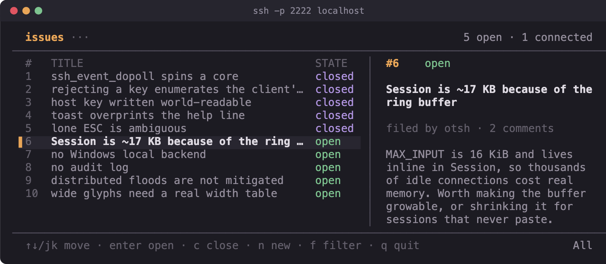
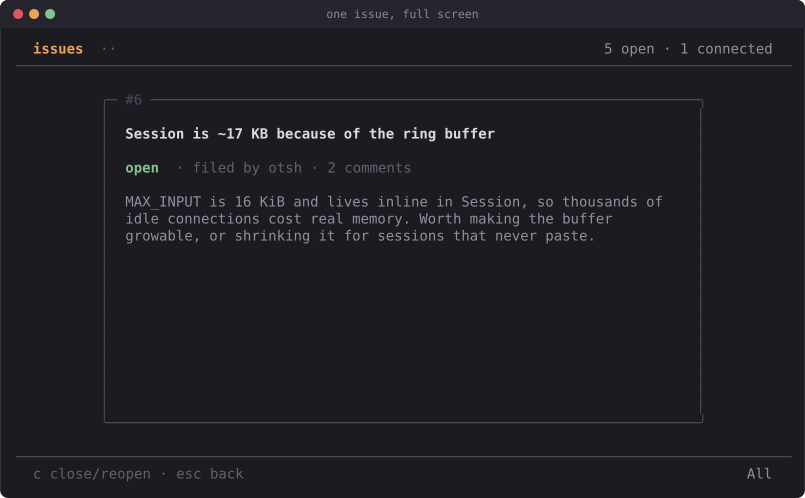
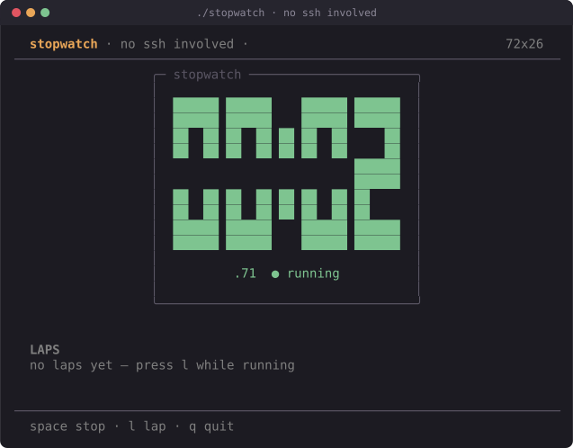

# otsh — SSH-served TUIs in Odin

**You `ssh` somewhere and you're in a full terminal app.** No install, no
client, no signup — it works from any machine with an `ssh` client, which is
every machine.

[](https://github.com/souriscloud/otsh/actions/workflows/ci.yml)
[](LICENSE)
[](https://odin-lang.org)



## Try it

```sh
git clone https://github.com/souriscloud/otsh && cd otsh
./build.sh examples/tracker      # builds examples/tracker -> ./tracker
./tracker                        # serves on 0.0.0.0:2222
```

In another terminal:

```sh
ssh -p 2222 localhost
```

You're now looking at a shared issue tracker rendered live over SSH — the
screenshot above is that exact session. Everyone connected sees the same
board; close an issue and every other session sees it change.

The identical binary also runs with no network at all:

```sh
./tracker --local
```

Same code, same `Model`, same `view` — `sshtui.run_local` just points the
renderer at your terminal instead of an SSH channel.

## The trick

An SSH server does not have to run a shell. When your `ssh` client connects it
sends a `pty-req` ("give me a terminal; here is `$TERM` and my window size"),
then `shell` ("now start something"). A normal `sshd` answers by allocating a
real pseudo-terminal and forking your login shell. Nothing in the protocol
requires that. `otsh` answers `pty-req` with "noted" — allocating nothing —
and treats the SSH channel itself as the terminal: bytes the client sends are
keystrokes, bytes you send back are ANSI escape sequences, and a
`window-change` message is `SIGWINCH`. `sshtui` is the piece that wires this
up, handing each connection's channel to a `tui.Program` in place of the local
terminal. The app has no idea it is on a network.

One consequence worth knowing: raw mode is the *client's* job. Because the
client asked for a pty, its own terminal goes into raw mode locally — this
server never calls `tcsetattr` and never touches termios.

(Prior art, credited: this shape is best known from Go, where Charm's `wish`
does the SSH half and `bubbletea` the TUI half. otsh is an independent Odin
implementation of the same idea, not a port.)

## Three procs and a config

<!-- check:file -->
```odin
package main

import "core:fmt"
import "otsh:sshtui"
import "otsh:tui"

Model :: struct { count: int }

update :: proc(p: ^tui.Program, msg: tui.Msg) {
    m := (^Model)(p.app.data)
    #partial switch k in msg {
    case tui.Key:
        #partial switch k.kind {
        case .Up:   m.count += 1
        case .Down: m.count -= 1
        case .Esc:  tui.quit(p)
        }
    }
}

view :: proc(p: ^tui.Program, s: ^tui.Screen) {
    m := (^Model)(p.app.data)
    tui.draw_box(s, 2, 1, 30, 5, tui.Style{fg = tui.ansi(6)}, tui.BORDER_ROUND, " demo ")
    tui.draw_text(s, 4, 3, fmt.tprintf("count: %d", m.count), tui.Style{attrs = {.Bold}})
}

// One per connection, on that connection's own thread.
create :: proc(info: sshtui.Info) -> tui.App {
    return tui.App{data = new(Model), update = update, view = view}
}
destroy :: proc(app: tui.App) { free(app.data) }

main :: proc() {
    sshtui.serve({
        port          = 2222,
        host_key_path = "hostkey",   // generated on first run
        create        = create,
        destroy       = destroy,
    })
}
```

`examples/whoami/main.odin` is the whole thing, start to finish, in about 100 lines.

## Why it's built this way

- **Small and dependency-light.** Four packages — `libssh`, `ssh`, `tui`,
  `sshtui`. Odin has no SSH implementation in `core:`, so the transport comes
  from libssh; that's ~280 lines of bindings for the server subset, and
  everything else is plain Odin.
- **Write once, run two ways.** `tui` has no dependency on `ssh` and vice
  versa — `sshtui` just joins them behind a three-closure `Backend`. Your app
  code never mentions SSH, which is what makes `--local` possible at all.
- **Identity without harvesting.** Rejecting an SSH public key makes the
  client offer its next one — verified here, a server that rejects unknown
  keys learns 4 of 4 keys in a client's agent before authenticating anyone.
  `otsh` accepts the probe and gives you `Info.id` instead: an
  `HMAC-SHA256(server_secret, fingerprint)`, truncated to 128 bits — stable,
  local to this server, and irreversible even with the whole database.
- **Modern transport only, by default.** curve25519 key exchange, ed25519
  host key, ChaCha20-Poly1305 / AES-GCM. No SHA-1, no CBC, no NIST curves —
  confirmed by negotiation tests that force-offer them and get refused.
- **Resource limits on by default.** 256 concurrent sessions, 8 per source
  IP, a 20-second handshake timeout, 6 failed auth attempts per connection —
  see `ssh.DEFAULT_LIMITS`.
- **Measured, not asserted.** On a 100×30 session: first paint 6.3 KB, idle
  throughput ~530 B/s, one keypress ~230 B. Four concurrent animated sessions
  cost ~3.7% of one core. The diff renderer is why — it emits only the escape
  sequences needed to reconcile a frame, not a repaint.
- **80 tests, no network needed** (`./test.sh`) — text metrics, input
  decoding, the diff renderer checked against a model terminal, audit-line
  formatting, resource limits, shutdown defaults, fuzzed parser and renderer
  input, identity properties (same key → same id, different secrets →
  unlinkable ids) pinned against an independent HMAC implementation, and the
  crypto algorithm lists validated name by name against libssh.

## Screenshots

<table>
<tr>
<td width="50%"><br><sub>tracker — split list + detail</sub></td>
<td width="50%"><br><sub>Filing an issue — a text-input view</sub></td>
</tr>
<tr>
<td width="50%"><br><sub>Issue detail</sub></td>
<td width="50%"><br><sub><code>whoami</code> — the verified key fingerprint</sub></td>
</tr>
<tr>
<td width="50%"><br><sub><code>guestbook</code> — shared state across sessions</sub></td>
<td width="50%"><br><sub><code>stopwatch</code> — local-only, no SSH involved</sub></td>
</tr>
</table>

Every screenshot here and in `docs/` is a real capture: a script drives a real
`ssh` client on a real pty and renders what comes back (`docs/tools/capture.py`).
None of these are mockups.

## Documentation

Full docs are in [docs/](docs/index.md), including two build-it-yourself
tutorials, and render as a local website with `python3 docs/tools/build_site.py --serve`.

Tutorials: [a stopwatch, no SSH](docs/tutorial-tui.md) ·
[a shared guestbook](docs/tutorial-guestbook.md)

Reference: [getting started](docs/getting-started.md) ·
[cookbook](docs/cookbook.md) ·
[tui](docs/tui.md) ·
[ssh](docs/ssh.md) ·
[sshtui](docs/sshtui.md) ·
[architecture](docs/architecture.md)

## Security posture

This is a networking library, so here is the honest version, not the
marketing one. Full detail, including the reasoning behind every design
choice above, is in [docs/security.md](docs/security.md).

Three independent reviewers audited this code with no stake in it, along
three lenses — memory and the C boundary, concurrency and lifecycle, auth and
crypto — and found ten real defects the author had missed, including two
remote crashes: an unbounded client-chosen pty size that panicked the process
on first draw, and a cross-thread allocator mismatch that could `SIGABRT` it
from a single unauthenticated connection. All ten are fixed, and all ten are
documented in [§11](docs/security.md#11-independent-audit-findings) with what
was broken and how it was found, because the class of mistake is more useful
than the patch. A fourth adversarial pass before 0.2.0 found three more — an
algorithm-list typo that silently downgraded the negotiated crypto, a client
that stopped reading pinning its session thread indefinitely, and leaks on
`serve`'s startup-failure paths — fixed and documented in
[§13](docs/security.md), which is equally explicit about what a review like
that is not.

That is diligence, not a certificate. **This has not been professionally
audited, and nobody should claim "secure" about network-facing code without
one.** The transport is libssh — its CVEs are your CVEs. TOFU is still TOFU:
the first connection trusts the host key blind, so publish its fingerprint
(`ssh-keygen -lf hostkey`) out of band. Rate limiting is per-process and
per-IP, not distributed. There is an audit log, but it is opt-in and off by
default — every line carries a peer address, so nothing is recorded until you
set `Config.audit`. There's no account recovery. Whatever your *app* does with
untrusted input is on you — otsh hands you bytes.

## Requirements

- Odin (nightly; uses `core:sys/posix`)
- libssh ≥ 0.10.6 (`brew install libssh` / `apt install libssh-dev`) — the
  server refuses to start against anything older, which is where the Terrapin
  fix landed
- macOS and Linux are the primary platforms. Windows builds and runs too,
  verified once on real hardware against a vcpkg libssh — see
  [getting started](docs/getting-started.md) for exactly what that covered.
  FreeBSD is only cross-type-checked in CI, never run.

## License

MIT. See [LICENSE](LICENSE).

## Contributing

Issues and pull requests are welcome. Run `./test.sh` before submitting; CI
builds every package and example on Linux for every push, runs the 80 tests
there along with the Windows and FreeBSD cross-type-checks, and runs the
macOS and Windows jobs on pull requests, weekly, and on release tags. This is a
security-sensitive library — a careful read of `ssh/` or `libssh/` looking
for the next defect is worth at least as much as a feature.
