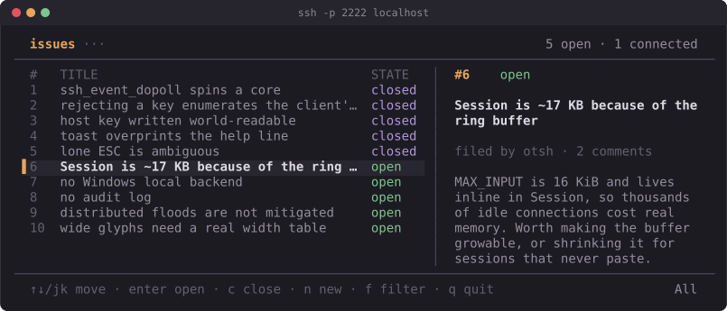

# otsh — SSH-served TUIs in Odin

Odin packages for building terminal apps you connect to with `ssh`. Write a
TUI once; serve it over SSH to many concurrent users, or run it in your own
terminal with one flag.

```sh
./build.sh                     # builds examples/tracker -> ./tracker
./tracker                      # serves on 0.0.0.0:2222
ssh -p 2222 localhost

./tracker --local              # same app, this terminal, no SSH
```



## How it works

The load-bearing insight is smaller than it looks:

**An SSH server does not have to run a shell.** When your `ssh` client connects
it sends a `pty-req` ("give me a terminal; here is `$TERM` and my window size"),
then `shell` ("now start something"). A normal `sshd` answers by allocating a
real pseudo-terminal and forking your login shell. Nothing in the protocol
requires that. You can answer `pty-req` with "noted" — allocating nothing — and
then treat the SSH channel itself as the terminal:

- bytes the client sends = keystrokes
- bytes you send back = ANSI escape sequences
- `window-change` messages = `SIGWINCH`

`sshtui` is the piece that wires this up here, handing each connection's channel
to a `tui.Program` in place of the local terminal. The app has no idea it is on
a network. That is the entire trick.

Prior art, credited: this approach is best known from Go, where Charm's
[`wish`](https://github.com/charmbracelet/wish) does the SSH half and
[`bubbletea`](https://github.com/charmbracelet/bubbletea) the TUI half. otsh is
an independent Odin implementation of the same idea, not a port.

One consequence worth internalizing: **raw mode is the client's job.** Because
the client asked for a pty, *its* terminal goes into raw mode locally. This
server never calls `tcsetattr` and never touches termios. The only termios code
in the repo is in the local backend, where there is no SSH client to do it.

## The packages

```
otsh:libssh    raw bindings to libssh's server API       (≈ x/crypto/ssh)
otsh:ssh       accept → handshake → auth → pty → shell   (≈ wish)
otsh:tui       screen buffer, diff renderer, key parser  (≈ bubbletea + lipgloss)
otsh:sshtui    glue: serve a tui.App over SSH
```

`tui` has no dependency on `ssh` and vice versa. `sshtui` joins them. Use `tui`
alone if you just want a local TUI; use `ssh` alone if you want SSH without this
renderer.

Odin has no SSH implementation in `core:`, so the transport comes from libssh
(`brew install libssh` / `apt install libssh-dev`). That is ~280 lines of
bindings for the server subset; the rest is plain Odin.

### Using it from your own project

```sh
odin build yourapp \
  -collection:otsh=/path/to/otsh \
  -extra-linker-flags:"-L$(pkg-config --variable=libdir libssh) -Wl,-rpath,$(pkg-config --variable=libdir libssh)"
```

`./build.sh path/to/yourapp` does exactly this if you'd rather not retype it.

## Writing an app

Three procs and a config. `examples/whoami/main.odin` is the whole thing in 90
lines, `examples/members` shows key-driven auth, and `examples/tracker` is a
real app.

```odin
package main

import "otsh:sshtui"
import "otsh:tui"

Model :: struct { count: int }

update :: proc(p: ^tui.Program, msg: tui.Msg) {
    m := (^Model)(p.app.data)
    #partial switch k in msg {
    case tui.Key:
        #partial switch k.kind {
        case .Up:   m.count += 1
        case .Down: m.count -= 1
        case .Esc:  tui.quit(p)
        }
    }
}

view :: proc(p: ^tui.Program, s: ^tui.Screen) {
    m := (^Model)(p.app.data)
    tui.draw_box(s, 2, 1, 30, 5, tui.Style{fg = tui.ansi(6)}, tui.BORDER_ROUND, " demo ")
    tui.draw_text(s, 4, 3, fmt.tprintf("count: %d", m.count), tui.Style{attrs = {.Bold}})
}

// One per connection, on that connection's own thread.
create :: proc(info: sshtui.Info) -> tui.App {
    return tui.App{data = new(Model), update = update, view = view}
}
destroy :: proc(app: tui.App) { free(app.data) }

main :: proc() {
    sshtui.serve({
        port          = 2222,
        host_key_path = "hostkey",   // generated on first run
        create        = create,
        destroy       = destroy,
    })
}
```

`sshtui.run_local(cfg)` runs the identical `App` against your own terminal.

### What `create` is told

```odin
Info :: struct {
    user, term:  string,  // what the client offered — `user` is unverified
    id:          string,  // pseudonymous account id; store THIS (see below)
    fingerprint: string,  // "SHA256:…" of the verified key; prefer `id`
    key_type:    string,  // "ssh-ed25519", …
    auth_method: string,  // "none" | "password" | "publickey" | "local"
    remote_addr: string,  // numeric peer address, no reverse DNS
    cols, rows:  int,     // initial geometry
    local:       bool,
    session:     ^ssh.Session,  // escape hatch; nil when local
}
```

`user` is whatever the client typed after `ssh` — they choose it freely, so
never treat it as identity. `id` is the one to key your data on.

### `Msg`

`tui.Key`, `tui.Mouse`, `tui.Resize`, `tui.Tick`. `Tick` carries `dt` in
seconds, so animation is frame-rate independent.

### Drawing

`view` paints a whole frame into a cell grid; nothing is incremental at the app
level. `set_cell`, `draw_text`, `draw_text_clipped`, `fill_rect`, `draw_box`,
`set_cursor`, plus `text_width`/`rune_width` which account for CJK and emoji.
`Style` is `{fg, bg: Color, attrs: bit_set}`; colors are `no_color()`,
`ansi(n)`, or `rgb(r,g,b)`.

## How SSH key auth actually works

Worth understanding before you rely on it, because the obvious design is the
wrong one.

Public key auth is **two messages**, not one (RFC 4252 §7):

1. **The probe.** The client sends `USERAUTH_REQUEST` with method `publickey`,
   a flag set to `FALSE`, and a public key — *no signature*. It is asking
   "would this key work?" Anyone can send anyone else's public key here; it
   proves nothing whatsoever.
   The server answers `PK_OK` or `FAILURE`.
2. **The proof.** If the server said `PK_OK`, the client re-sends the request
   with the flag `TRUE` and a signature over:
   the **session identifier**, the username, the service, the method, and the
   key. The session identifier is the exchange hash from key exchange — unique
   to this one connection.

That last detail is what makes it safe: the signature is bound to a specific
connection to a specific host key. A malicious server cannot replay what you
signed to log into a different server, and cannot reuse it tomorrow.

`otsh` never shows step 1 to your application. The `Authenticator` and
`Info.fingerprint` only ever see a key that reached step 2 and verified.

### The counterintuitive part: rejecting keys harvests them

The client walks its keys in order. Reject one and it offers the next, and the
next, until it runs out. **A server that rejects unknown keys learns every
public key in the user's agent** — before authenticating anyone. Public keys
are not secret, but they are a durable cross-service identifier, so this is a
real fingerprinting vector.

Verified here, against this server, with a client offering four keys:

| Server behaviour | Public keys it learned |
| --- | --- |
| Rejects unknown keys | **4 of 4** |
| Accepts the first key | **1 of 4** |

So `otsh` accepts the probe unconditionally and gives you identity instead of a
veto. **Do not gate at the SSH layer.** Take `Info.id`, and show non-members a
"you are not on the list" screen inside the app. They are just as excluded, and
you learned exactly one key. `examples/members` is that pattern; if you set an
`Authenticator` that rejects a key, otsh prints a one-time note explaining this.

One caveat for identity apps: every OpenSSH client tries the `none` method
first. If you accept it — the default — the client never offers a key at all
and `Info.id` is empty. Set `methods = {.Publickey}`. That does not reintroduce
enumeration, because the first key offered is still accepted.

## Identity without harvesting

A fingerprint is a fine account id and a bad thing to store. It is global: if
your database leaks, anyone can correlate your users with any other service
that saw the same keys, and can check "was this person a user here?" against a
public key they already have.

So set `identity_secret` and use `Info.id` instead. It is
`HMAC-SHA256(server_secret, fingerprint)`, truncated to 128 bits:

- **stable** — same key, same id, forever
- **local** — meaningless to anyone else, even holding the same public key
- **irreversible** — an attacker with your whole database cannot recover a
  public key or test a candidate one without also stealing the secret

```odin
sshtui.serve({
    identity_secret = "identity_secret",  // created 0600 on first run
    methods         = {.Publickey},
    create          = create,
})
```

Verified: same key → same id across reconnects; different keys → different ids;
the raw fingerprint never has to leave the process. Use `ssh.ids_equal` rather
than `==` when checking an id against a stored one, so lookups do not leak
where they differed via timing.

Back the secret up with the host key. Losing it does not expose anything — it
just re-pseudonymises everyone, so every user looks new.

## What is hardened, and what is still on you

Enabled by default:

- **Modern algorithms only.** curve25519 key exchange, ed25519 host key,
  ChaCha20-Poly1305 / AES-GCM. No SHA-1, no CBC, no NIST curves. Confirmed by
  negotiation: `-c aes128-cbc` and
  `-o KexAlgorithms=diffie-hellman-group14-sha1` are both refused.
- **Host key and identity secret are created `0600`**, with `O_EXCL` so a race
  cannot clobber an existing one, and a warning at startup if either is group-
  or world-readable.
- **Resource limits** (`ssh.DEFAULT_LIMITS`): 256 concurrent sessions, 8 per
  source IP, a 20-second handshake timeout so a silent client cannot pin a
  thread, and 6 failed auth attempts per connection. Per field: `0` takes the
  default, negative disables that one.
- **Only verified keys reach your code**, as described above.
- **No reverse DNS** on peer addresses — that would leak every connection to a
  resolver.
- Fingerprint and id buffers are zeroed on session teardown; `exec` and
  `subsystem` requests are refused.

Still your responsibility, and not solvable in a library:

- **This has not been audited, and I am not going to tell you it is "100%
  secure" — nobody can say that about network-facing code.** What I can say is
  what it does and what it was tested against, above.
- The transport is libssh. Its CVEs are your CVEs; keep it patched.
- Anything the *app* does with untrusted input. otsh hands you bytes.
- TOFU is still TOFU: the first time a user connects they are trusting the host
  key blind. Publish its fingerprint
  (`ssh-keygen -lf hostkey`) somewhere out of band — a web page, a README,
  wherever you would publish a TLS fingerprint.
- Rate limiting is per-process and per-IP, which does not stop a distributed
  flood. Put it behind something that does if that is a threat you have.
- No audit log, no session recording, no account recovery. If a user loses
  their key they are a new person; decide what that means for your app before
  you need to.

## Implementation notes

**Concurrency.** One OS thread per connection, each running its own libssh event
loop, so every libssh callback fires on its own connection's thread and nothing
needs locking. Input lands in a fixed 16 KiB ring buffer; returning fewer bytes
than libssh offered is the protocol's flow control — it keeps the rest and
re-offers it.

**Rendering.** `flush()` diffs the new frame against the last rendered one and
emits only the escape sequences needed to reconcile them, extending runs across
gaps of up to four unchanged cells rather than emitting a cursor jump.
Measured on a 100×30 session: first paint 6.3 KB, idle ~530 B/s (only the
animated header pulse changes), one keypress ~230 B. A naive full repaint would be
~6 KB per frame — 180 KB/s at 30fps.

**Blocking.** `ssh_event_dopoll`'s timeout does not actually block; it returns
immediately every call. Left alone that spins a core per session, so `ssh.read`
waits on the session socket with `poll(2)` itself and calls `dopoll(0)` only to
parse. `tui.run` additionally paces frames, so a backend that returns early
cannot spin the loop. Four live animated sessions cost ~3.7% of one core.

**Escape ambiguity.** A lone `ESC` that stays lone for two frames is reported as
the Escape key — the standard timeout resolution for the standard problem.

## Not implemented

`exec` and `subsystem` requests are refused — this server only speaks TUI.

Per-IP connection limits, a handshake timeout and a concurrent-session cap
*are* implemented; see `ssh.Limits` and the [security model](docs/security.md).

## Documentation

Full docs are in [docs/](docs/index.md), including two build-it-yourself
tutorials. They also render as a local website:

```sh
python3 docs/tools/build_site.py --serve   # http://localhost:8000
```

Tutorials: [a stopwatch, no SSH](docs/tutorial-tui.md) ·
[a shared guestbook](docs/tutorial-guestbook.md)

Reference:
[getting started](docs/getting-started.md) ·
[cookbook](docs/cookbook.md) ·
[tui](docs/tui.md) ·
[ssh](docs/ssh.md) ·
[sshtui](docs/sshtui.md) ·
[security model](docs/security.md) ·
[architecture](docs/architecture.md)

## Requirements

- Odin (nightly; uses `core:sys/posix`)
- libssh ≥ 0.10
- macOS and Linux. Windows needs a different local backend and a libssh build.
