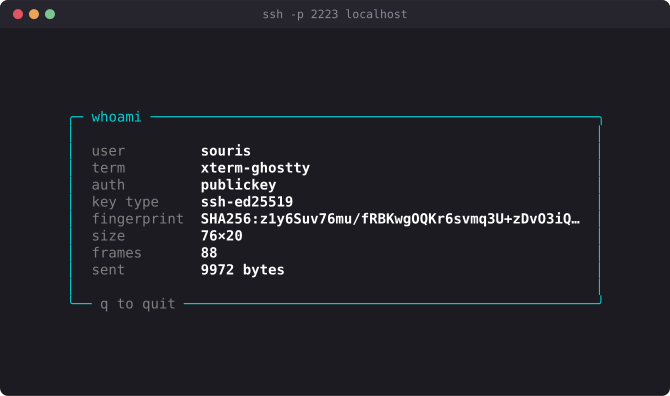
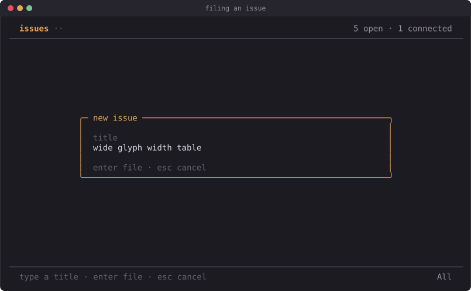

# otsh documentation

Odin packages for building terminal apps you reach with `ssh`. Write a TUI
once, serve it to many concurrent users over SSH, or run the identical app in
your own terminal.


The [README](../README.md) is the short version. These pages are the long one.

Every screenshot in these docs is a real capture: a script connects to the app
with a real `ssh` client on a real pty, records what comes back, and renders
the resulting cell grid as SVG. See `docs/tools/capture.py`.

## Reading these as a website

The Markdown reads fine on its own, but there is a generator that turns it into
a browsable local site with a sidebar, search-friendly anchors, syntax
highlighting and a light/dark toggle:

```sh
python3 docs/tools/build_site.py           # writes docs/site/
python3 docs/tools/build_site.py --serve   # and serves it on :8000
python3 docs/tools/build_site.py --check   # validate output, exit 1 on problems
```

`--check` verifies every internal link and image resolves, that no Markdown
survived unconverted, and that the sidebar actually rendered. It is worth
running after editing any page.

Standard library only — no `pip install`, no network, no Node. Documentation
you cannot build is documentation that rots, so the generator is about 650
lines in `docs/tools/build_site.py` and has no dependencies to break.

Regenerating the screenshots is a separate, authoring-time step and does need
one package:

```sh
pip install pyte
./build.sh examples/tracker && ./tracker &                     # start an example
python3 docs/tools/capture.py --port 2222 --keys 'jj' \
    --title "ssh -p 2222 localhost" --out docs/assets/tracker-list.svg
```

## Start here

| Page | What it covers |
| --- | --- |
| [Getting started](getting-started.md) | Requirements, building, running the examples, your first app, `--local` development, using otsh from another project |
| [Cookbook](cookbook.md) | Copy-pasteable recipes: scrolling lists, text input, layout, animation, per-user state, mouse, wide characters |

## Tutorials

Both build a complete, working program end to end. Start with the stopwatch if
you have not used `tui` before — it teaches the rendering model with no network
in the way.

| Tutorial | Builds |
| --- | --- |
| [A stopwatch, with no SSH involved](tutorial-tui.md) | A local timer with big ASCII digits, laps and scrolling. Teaches the frame loop, `dt`-based timing, input and layout. Ships as `examples/stopwatch` |
| [A shared guestbook](tutorial-guestbook.md) | An SSH-served guestbook: list rendering, a text-input mode, shared state behind a mutex, and key-derived identity. Ships as `examples/guestbook` |

## Guides

Prose explanations of how each package fits together and why.

| Page | Package | What it covers |
| --- | --- | --- |
| [tui](tui.md) | `otsh:tui` | Screen, cells, styles, drawing, the `App`/`Program` loop, keyboard and mouse input, the `Backend` abstraction |
| [ssh](ssh.md) | `otsh:ssh` | The server on its own: `serve`, `Config`, `Session`, auth, limits, identity. Usable without a TUI |
| [sshtui](sshtui.md) | `otsh:sshtui` | The glue most apps use: `Info`, `Config`, `serve`, `run_local`, connection lifecycle |

## API reference

Every exported declaration, with its exact signature and source location.
Generated from the sources by `docs/tools/gen_api.py`, so it cannot drift from
the code — run it after changing a doc comment.

| Page | Covers |
| --- | --- |
| [otsh:tui](api-tui.md) | screen, styles, drawing, input, the loop |
| [otsh:ssh](api-ssh.md) | server, session, auth, limits, identity |
| [otsh:sshtui](api-sshtui.md) | `Info`, `Config`, `serve`, `run_local`, `clone_info` |
| [otsh:libssh](api-libssh.md) | raw libssh bindings; each entry names the C function it maps to |

Use the guides to learn a subsystem, the API pages to look one thing up.

## Understanding it

| Page | What it covers |
| --- | --- |
| [Security model](security.md) | How SSH public key auth actually works, why rejecting keys harvests them, pseudonymous identity, transport hardening, and an honest threat model |
| [Architecture](architecture.md) | Internals: layering, connection lifecycle, the C callback boundary, the diff renderer, the `ssh_event_dopoll` blocking problem, concurrency and ownership |

## Operations

Running one for real, and the parts of that job the library cannot do for you.

| Page | What it covers |
| --- | --- |
| [Deployment and abuse mitigation](deploy.md) | The layers that go in front of the process: a hardened systemd unit, fail2ban on the audit log, nftables/pf rate limiting — plus what none of them stop. Ships working configs in `deploy/` |
| [Compatibility](compatibility.md) | The dependency contract: which Odin version is pinned and why, the libssh floor and the tested matrix, the measured struct layouts across 0.10/0.11/0.12, and what to check when you upgrade either one |

## The shape of an app

Three procs and a config. Everything else is detail:

```odin
create  :: proc(info: sshtui.Info) -> tui.App        // once per connection
update  :: proc(p: ^tui.Program, msg: tui.Msg)       // Key | Mouse | Resize | Tick
view    :: proc(p: ^tui.Program, s: ^tui.Screen)     // paint a full frame
```

`view` paints a complete frame every tick and the runtime diffs it, so you
never erase anything by hand. Your app code never mentions SSH — that is what
makes `sshtui.run_local` able to run the same binary against your own terminal.

## Two things that surprise people

**An SSH server does not have to run a shell.** Answering the client's
`pty-req` allocates nothing. The channel itself is the terminal: bytes in are
keystrokes, bytes out are ANSI escapes, `window-change` is `SIGWINCH`. A
consequence worth internalising is that raw mode is the *client's* job, so the
server never touches termios.

**Rejecting an unknown public key is the privacy-hostile option.** The client
answers a rejection by offering its next key, so a gating server learns the
user's whole agent. Accept the key and refuse inside the app instead. The
measurements and the reasoning are in [Security model](security.md).

## Examples

| Directory | Port | Demonstrates |
| --- | --- | --- |
| `examples/whoami` | 2223 | The smallest useful app; the auth hook |
| `examples/members` | 2226 | Key-driven identity done without harvesting keys |
| `examples/tracker` | 2222 | The full app: shared board, split layout, three views, text input, animation, `--local` |
| `examples/guestbook` | 2228 | The shared guestbook built in the tutorial |
| `examples/stopwatch` | — | The local stopwatch built in the tutorial (no SSH) |



Filing an issue — the same app, a different view:


