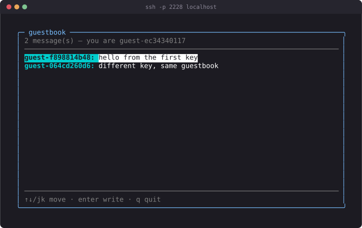

# Tutorial: a shared guestbook



This is what you are building, captured from a real session. The three
`guest-…` names are three different SSH keys — the screenshot was taken from a
third connection that is only reading what the first two left behind.

This tutorial builds a real otsh app from nothing: a guestbook that anyone can
`ssh` into, read, and sign. It ends as `examples/guestbook/main.odin` — a
working program you can run tonight, not a toy that stops at "hello world."

You will build the same file the whole way through, in eight steps. Each step
ends with something you can compile and connect to, so you always know the
code in front of you actually runs before you add the next idea to it.

Read [`./getting-started.md`](./getting-started.md) first if you have not
already — it covers installing Odin and libssh, what `build.sh` does, and the
three-proc shape of an app. This tutorial does not repeat that; it assumes you
can already build and run `examples/whoami`. It also leans on
[`./tui.md`](./tui.md), [`./sshtui.md`](./sshtui.md),
[`./cookbook.md`](./cookbook.md), and [`./security.md`](./security.md)
throughout — where something is already documented there in full, this page
links to it instead of restating it.

Work inside your otsh checkout, editing `examples/guestbook/main.odin`
directly, and build with:

```sh
./build.sh examples/guestbook
./guestbook
```

Then, from another terminal:

```sh
ssh -p 2228 localhost
```

Port 2228 is arbitrary — the only requirement is that it not collide with the
other bundled examples (`tracker` is 2222, `whoami` is 2223, `members` is 2226).

## 1. A window that says hello

Every otsh app is the same three procs wired together with `sshtui.serve`:

```odin
package main

import "otsh:sshtui"
import "otsh:tui"

Model :: struct {}

update :: proc(p: ^tui.Program, msg: tui.Msg) {
	#partial switch e in msg {
	case tui.Key:
		if e.kind == .Esc || (e.kind == .Rune && e.r == 'q') {
			tui.quit(p)
		}
	}
}

view :: proc(p: ^tui.Program, sc: ^tui.Screen) {
	tui.draw_text(sc, 2, 1, "hello, guestbook", tui.Style{})
	tui.draw_text(sc, 2, 2, "q to quit", tui.Style{fg = tui.ansi(8)})
}

create :: proc(info: sshtui.Info) -> tui.App {
	return tui.App{data = new(Model), update = update, view = view}
}

destroy :: proc(app: tui.App) {
	free(app.data)
}

main :: proc() {
	sshtui.serve(
		sshtui.Config {
			port          = 2228,
			host_key_path = "guestbook_hostkey",
			create        = create,
			destroy       = destroy,
		},
	)
}
```

`create` runs once, when a client finishes authenticating and asks for a
shell — it hands you an `sshtui.Info` describing that connection and expects
back a `tui.App`. `update` runs once per incoming `tui.Msg` (a keystroke, a
mouse event, a resize, or a tick) and is where your model changes. `view` runs
once per frame and is where you paint. `destroy` runs once, after the
connection's loop ends, to free whatever `create` allocated. All four run on
a thread private to that one connection — a fact that will matter a great
deal starting at step 5.

The detail worth sitting with now, because it explains almost everything
about how you'll write `view` for the rest of this tutorial: **`view` paints
a complete frame every tick.** There is no `erase`, no "undraw the old
selection," no diffing at the app level — `tui.run` clears the whole cell
grid before every call to `view` (`docs/tui.md`, "The model"). Whatever you
don't draw this tick is not there at all. The `tui.Screen` diffing that keeps
the actual bytes sent over the wire small happens one layer down, inside
`Screen` itself, and you never have to think about it. From where you're
sitting, drawing is always "describe the current frame, in full," never
"patch the previous one."

This is also the smallest a `Model` gets to be — an empty struct, because
step 1 has no state yet. `new(Model)` still has to happen, though, because
`tui.App.data` is a `rawptr` and something has to own the memory it points
at; `destroy`'s only job right now is giving that memory back.

**Checkpoint.** Build and connect:

```sh
./build.sh examples/guestbook
./guestbook
ssh -p 2228 localhost
```

You should see two lines of text and nothing else. Press `q` or `Esc` and the
connection ends cleanly — `tui.run` restores the terminal (leaves the
alternate screen, shows the cursor again) on every exit path, so you land
back at your shell prompt exactly as it was before you connected.

## 2. Draw the list

A guestbook is a list of messages. Give it a shape and some fake entries to
look at before worrying about where real ones come from:

```odin
Message :: struct {
	author: string,
	text:   string,
}

MESSAGES := []Message {
	{"ada", "first!"},
	{"grace", "hello from the compiler"},
	{"alan", "does this thing halt?"},
}
```

and draw them inside a bordered box:

```odin
view :: proc(p: ^tui.Program, sc: ^tui.Screen) {
	defer free_all(context.temp_allocator)
	tui.draw_box(sc, 2, 1, 60, 14, tui.Style{fg = tui.rgb(120, 190, 255)}, tui.BORDER_ROUND, " guestbook ")
	for msg, i in MESSAGES {
		y := 3 + i
		if y >= 12 {break}
		line := fmt.tprintf("%s: %s", msg.author, msg.text)
		tui.draw_text_clipped(sc, 4, y, 54, line, tui.Style{fg = tui.ansi(15)})
	}
	tui.draw_text(sc, 4, 12, "q to quit", tui.Style{fg = tui.ansi(8)})
}
```

(`update`, `create`, `destroy`, and `main` are unchanged from step 1; you'll
need `import "core:fmt"` for `fmt.tprintf`.)

`tui.draw_box` takes an absolute `x, y, w, h` and a `Style` for its border —
centering or otherwise positioning it is arithmetic you do yourself against
`sc.w`/`sc.h` (`docs/cookbook.md` recipe 4 covers this once the box needs to
be responsive; step 7 gets there). The title is drawn only when the box is
wide enough, clipped the same way the rows are.

Each row goes through `tui.draw_text_clipped` rather than `tui.draw_text`,
with a hard column budget (`54`, here). `draw_text` only stops at the screen
edge; `draw_text_clipped` degrades to a trailing `…` when the string would
exceed the budget instead of silently truncating mid-word, and it returns the
number of columns it actually used — you'll use that return value in step 6
to line up two differently-styled pieces of the same row. The loop's own
`if y >= 12 {break}` is the simplest possible way to keep from drawing past
the box: it clips, but it does not scroll. `docs/cookbook.md` recipe 1 opens
with exactly this distinction — clipping is enough while the list always
fits, and stops being enough the moment it doesn't. For a hardcoded
three-entry list it fits. Step 7 replaces this loop once it no longer does.

Two color constructors appear here, and it's worth knowing why both exist.
`tui.ansi(idx)` selects a 256-color palette index — cheap, and it plays well
with terminals that don't do true color. `tui.rgb(r, g, b)` emits a 24-bit
escape directly; use it when you want one specific color regardless of the
user's palette, which is why the box border above asks for it by exact value
rather than picking the nearest palette entry. Neither call queries the
terminal for what it actually supports — `docs/tui.md`'s "Style and color"
section covers the third option, `tui.no_color()`, for "don't override
whatever the user's terminal already shows," which is what a bare
`tui.Style{}` already gives you for anything you don't set.

**Checkpoint.** Rebuild and reconnect. You should see a bordered "guestbook"
box containing three fake messages, each rendered as `author: text`.

## 3. Make it respond

A list you can't move through isn't a list, it's a paragraph. Add a cursor:

```odin
Model :: struct {
	cursor: int,
}
```

and handle the keys that move it:

```odin
update :: proc(p: ^tui.Program, msg: tui.Msg) {
	m := (^Model)(p.app.data)
	#partial switch e in msg {
	case tui.Key:
		#partial switch e.kind {
		case .Up:
			m.cursor = max(m.cursor - 1, 0)
		case .Down:
			m.cursor = min(m.cursor + 1, len(MESSAGES) - 1)
		case .Esc:
			tui.quit(p)
		case .Rune:
			switch e.r {
			case 'k':
				m.cursor = max(m.cursor - 1, 0)
			case 'j':
				m.cursor = min(m.cursor + 1, len(MESSAGES) - 1)
			case 'q':
				tui.quit(p)
			}
		}
	}
}
```

and highlight the selected row in `view` by reversing it:

```odin
st := tui.Style{fg = tui.ansi(15)}
if i == m.cursor {st.attrs = {.Reverse}}
tui.draw_text_clipped(sc, 4, y, 54, line, st)
```

Two nested `#partial switch` statements are doing the real work here, and
both matter. `msg` is a `tui.Msg`, a union of `Key | Mouse | Resize | Tick`
(`docs/tui.md`, "`Msg`") — a plain `switch` on a union in Odin has to handle
every variant, so `#partial switch e in msg { case tui.Key: ... }` says "I
only care about keys right now, leave the rest alone" without you having to
write empty cases for `Mouse`/`Resize`/`Tick`. The inner
`#partial switch e.kind` does the same thing one level down: `tui.Key_Kind`
has almost thirty values (`docs/tui.md`, "Input") and this app only reacts to
five of them. `#partial` is the idiom you'll use for every `update` you write
against this package — a plain `switch` here would force you to enumerate
every key kind that exists, most of which this app has no opinion about.

`.Reverse` is one of six bits in `tui.Attrs` (`docs/tui.md`, "Style and
color"); flipping it swaps foreground and background using whatever colors
were already there, which is why it's the recommended way to show a
selection when you want it to track the user's own terminal theme rather
than imposing a fixed highlight color (`docs/cookbook.md` recipe 9 contrasts
this with `examples/tracker`'s fixed `C_SEL_BG`, which is a deliberate choice
there, not the default you should reach for first).

**Checkpoint.** Rebuild, reconnect, and confirm `↑`/`↓`/`j`/`k` move a visible
highlight between the three rows, and it stays clamped at both ends instead
of running off the list.

## 4. Type a message

Reading a guestbook is half the app. Writing to it is the other half, and it
needs a second mode: one where keys move the cursor, and one where keys
build up a line of text. Add both:

```odin
Mode :: enum {
	Browse,
	Compose,
}

Model :: struct {
	messages: [dynamic]Message, // step 5 promotes this to package scope
	cursor:   int,
	mode:     Mode,
	buf:      [240]u8,
	buf_len:  int,
}
```

`update` now dispatches on `m.mode` before it dispatches on the key, which is
the same "one enum picked twice" pattern `docs/cookbook.md` recipe 2 shows
for `examples/tracker`'s menu/cart/receipt screens — there it's three views
dispatching draw calls, here it's two modes dispatching key handling:

```odin
update :: proc(p: ^tui.Program, msg: tui.Msg) {
	m := (^Model)(p.app.data)
	#partial switch e in msg {
	case tui.Key:
		switch m.mode {
		case .Browse:
			browse_key(p, m, e)
		case .Compose:
			compose_key(m, e)
		}
	}
}

browse_key :: proc(p: ^tui.Program, m: ^Model, k: tui.Key) {
	n := len(m.messages)
	#partial switch k.kind {
	case .Up:
		m.cursor = max(m.cursor - 1, 0)
	case .Down:
		m.cursor = min(m.cursor + 1, n - 1)
	case .Esc:
		tui.quit(p)
	case .Enter:
		m.mode = .Compose
		m.buf_len = 0
	case .Rune:
		switch k.r {
		case 'k':
			m.cursor = max(m.cursor - 1, 0)
		case 'j':
			m.cursor = min(m.cursor + 1, n - 1)
		case 'q':
			tui.quit(p)
		}
	}
}

compose_key :: proc(m: ^Model, k: tui.Key) {
	#partial switch k.kind {
	case .Enter:
		commit_message(m)
	case .Esc:
		m.buf_len = 0
		m.mode = .Browse
	case .Backspace:
		if m.buf_len > 0 {
			_, size := utf8.decode_last_rune(m.buf[:m.buf_len])
			m.buf_len -= size
		}
	case .Space:
		insert_rune(m, ' ')
	case .Rune:
		insert_rune(m, k.r)
	}
}
```

The key decoder hands you one `tui.Key` per keystroke, never a whole line, so
building a text field means accumulating runes into a buffer yourself
(`docs/cookbook.md` recipe 3 is this exact pattern):

```odin
insert_rune :: proc(m: ^Model, r: rune) {
	b, n := utf8.encode_rune(r)
	if m.buf_len + n <= len(m.buf) {
		copy(m.buf[m.buf_len:], b[:n])
		m.buf_len += n
	}
}

// text is a view into m.buf, which gets reused the moment you start typing
// the next message — clone it before it goes anywhere that outlives this call.
commit_message :: proc(m: ^Model) {
	text := strings.trim_space(string(m.buf[:m.buf_len]))
	if text != "" {
		append(&m.messages, Message{author = "you", text = strings.clone(text)})
	}
	m.buf_len = 0
	m.mode = .Browse
}
```

A few things are easy to get wrong here and worth calling out directly.
`.Backspace` has to step back one *rune*, not one byte —
`utf8.decode_last_rune` tells you how many bytes the last rune actually took,
which matters the moment someone types something outside ASCII.
`.Rune` fires for most printable characters, but Space is its own
`Key_Kind` (`.Space`, not `.Rune`) — miss that case and the space bar does
nothing in your input field, which is exactly the kind of bug you only
notice once someone tries to type a sentence. And `commit_message` clones
`text` before storing it: `text` is a slice into `m.buf`, and the moment
`compose_key` starts accepting keystrokes for the *next* message,
`insert_rune` overwrites that same buffer. Skip the `strings.clone` and every
message you've "saved" ends up aliasing whatever you happened to type most
recently — you'd only discover this by posting a second message and watching
the first one's text change.

You also need a real, visible cursor, since none of the drawing primitives
draw one for you:

```odin
if m.mode == .Compose {
	text := string(m.buf[:m.buf_len])
	line := fmt.tprintf("> %s", text)
	tui.draw_text_clipped(sc, 4, 12, 54, line, tui.Style{fg = tui.ansi(15)})
	tui.set_cursor(sc, 4 + tui.text_width("> ") + tui.text_width(text), 12)
} else {
	tui.draw_text(sc, 4, 12, "enter write · up/down/jk move · q quit", tui.Style{fg = tui.ansi(8)})
}
```

`tui.set_cursor(sc, x, y)` marks the real terminal cursor visible at `(x, y)`
for this frame. Because `screen_clear` resets cursor visibility to hidden
before every `view` call (step 1's lesson, applied again), you have to call
`set_cursor` every single tick you want it shown — there's no "turn it on
once." And the `x` you pass has to be a column count, not a byte count:
`tui.text_width(text)`, not `m.buf_len`. They agree for plain ASCII and
silently diverge the moment the guestbook has a message with a wide
character or an emoji in it — `docs/tui.md`'s "Text metrics" section is the
full explanation of why column position, not byte position, is the
coordinate system this whole package draws in.

Finish by seeding each new connection's own list and freeing it on the way
out:

```odin
SEED := []Message {
	{"ada", "first!"},
	{"grace", "hello from the compiler"},
	{"alan", "does this thing halt?"},
}

create :: proc(info: sshtui.Info) -> tui.App {
	m := new(Model)
	m.messages = make([dynamic]Message, 0, 8)
	append(&m.messages, ..SEED)
	return tui.App{data = m, update = update, view = view}
}

destroy :: proc(app: tui.App) {
	m := (^Model)(app.data)
	delete(m.messages)
	free(app.data)
}
```

(`append(&m.messages, ..SEED)` spreads a slice into `append`'s variadic
arguments — the same idiom `tui`'s own input pipeline uses internally to
refill its pending-bytes buffer.)

**Checkpoint.** Rebuild, reconnect, press `Enter`, type a line, press `Enter`
again. Your message appears at the bottom of the list. Now open a *second*
terminal and connect again while the first session is still open. Notice two
things: the newcomer starts from the same three seed messages, not from what
you typed a moment ago — and if you type something in the second session, the first
session never sees it, even after you press `q` and reconnect. Every
connection got its own private `[dynamic]Message`, because `m.messages` lives
on a `Model` that `create` allocates fresh per connection. That's the gap
step 5 closes.

## 5. Share it between users

**This is the important step.** Everything before it was a single-player
guestbook that happened to be reachable over SSH. A guestbook where nobody
can read what anyone else wrote is not a guestbook.

The reason this needs care, and is more than moving a variable, is the
connection model described in `docs/sshtui.md` ("`Create_Proc`, `Destroy_Proc`,
and the connection lifecycle"): each accepted connection gets its own OS
thread, and `create`/`update`/`view`/`destroy` for that connection all run on
it, start to finish. There is no lock around any of that *within* one
session, because nothing needs one — but the moment two connections need to
touch the *same* data, that data is being read and written from multiple
threads at once with no ordering guarantee between them, which is a data
race by definition. `examples/members/main.odin` hits this exact problem for
its roster and solves it the same way you're about to: a package-level
variable guarded by a `sync.Mutex`, locked for the shortest possible
duration around each read or write.

Move `messages` out of `Model` and up to package scope:

```odin
import "core:sync"

Message :: struct {
	author: string, // owned copy — see add_message
	text:   string, // owned copy
}

messages: [dynamic]Message
messages_mu: sync.Mutex

message_count :: proc() -> int {
	sync.lock(&messages_mu)
	defer sync.unlock(&messages_mu)
	return len(messages)
}

message_at :: proc(i: int) -> (Message, bool) {
	sync.lock(&messages_mu)
	defer sync.unlock(&messages_mu)
	if i < 0 || i >= len(messages) {
		return {}, false
	}
	return messages[i], true
}

// Shared state on a public port must be bounded, or anyone with an SSH key
// can grow this process's memory without limit.
MAX_MESSAGES :: 500

add_message :: proc(author, text: string) -> bool {
	sync.lock(&messages_mu)
	defer sync.unlock(&messages_mu)
	if len(messages) >= MAX_MESSAGES {
		return false
	}
	append(&messages, Message{author = strings.clone(author), text = strings.clone(text)})
	return true
}
```

Two things about `add_message` deserve a closer look. The cap first: the
moment `messages` moved to package scope it became state fed by *anyone who
can reach the port*, and unbounded shared state on a listening socket is a
memory-growth endpoint — one scripted client posting in a loop grows the
process until the OS kills it. A cap turns that into a "guestbook is full"
notice instead. Second, where the cap's check sits: *inside* the lock, in the
same critical section as the `append`. Checked outside — say,
`message_count() >= MAX_MESSAGES` before calling — two sessions racing for
the last slot could both pass the check and push past the cap. Same lesson as
the rest of this step, applied to a limit rather than a list.
(`commit_message` ignores the returned `bool` for now; step 8's footer
feedback surfaces it.)

Every other connection's `view` reads through `message_count`/`message_at`,
never by indexing `messages` directly, and `commit_message` writes through
`add_message`, never by calling `append(&messages, ...)` itself. That
discipline — nobody touches the shared variable except through a function
that locks first — is the entire technique. There's no cleverer synchronization
happening; it's the same lock around the same three operations, applied
consistently everywhere the data is touched. `Model` loses its `messages`
field and its per-connection seed entirely — a fresh server now starts with
an honest, empty guestbook rather than three fake rows duplicated into every
new session:

```odin
Model :: struct {
	cursor:  int,
	mode:    Mode,
	buf:     [240]u8,
	buf_len: int,
}

commit_message :: proc(m: ^Model) {
	text := strings.trim_space(string(m.buf[:m.buf_len]))
	if text != "" {
		add_message("you", text) // step 6 replaces "you" with a real identity
	}
	m.buf_len = 0
	m.mode = .Browse
}

view :: proc(p: ^tui.Program, sc: ^tui.Screen) {
	defer free_all(context.temp_allocator)
	m := (^Model)(p.app.data)

	tui.draw_box(sc, 2, 1, 60, 14, tui.Style{fg = tui.rgb(120, 190, 255)}, tui.BORDER_ROUND, " guestbook ")

	n := message_count()
	for row in 0 ..< 9 {
		if row >= n {break}
		msg, ok := message_at(row)
		if !ok {break}
		y := 3 + row
		line := fmt.tprintf("%s: %s", msg.author, msg.text)
		st := tui.Style{fg = tui.ansi(15)}
		if m.mode == .Browse && row == m.cursor {st.attrs = {.Reverse}}
		tui.draw_text_clipped(sc, 4, y, 54, line, st)
	}
	// ... compose-mode footer unchanged from step 4
}

create :: proc(info: sshtui.Info) -> tui.App {
	return tui.App{data = new(Model), update = update, view = view}
}

main :: proc() {
	messages = make([dynamic]Message, 0, 64)
	sshtui.serve(
		sshtui.Config{port = 2228, host_key_path = "guestbook_hostkey", create = create, destroy = destroy},
	)
}
```

`message_at` returns a *copy* of a `Message` — two string headers, not the
bytes themselves — after releasing the lock. That's safe specifically
because nothing in this app ever deletes or mutates a stored message: the
underlying bytes each string points at, once cloned into `messages` by
`add_message`, live for the rest of the process. If you later add a feature
that removes or edits entries, revisit this — a copy taken under a lock is
only as safe as the guarantee that what it points to doesn't change out from
under it afterward.

**Checkpoint.** Rebuild, then open two SSH sessions side by side (two
terminal windows both running `ssh -p 2228 localhost`). Post a message from
one. Within a frame or two — no keypress required in the other window,
because `view` runs on every tick regardless of input — it appears in the
second session too. That's the payoff of this step: state that used to die
with the connection now outlives it, visible to everyone.

## 6. Say who wrote it

Every message right now is attributed to the literal string `"you"`, which
is worse than useless once two people are using the same server. otsh's
answer to "who is this" without asking anyone to create an account is
`sshtui.Info.id` — read `docs/security.md` in full for how it's derived and
why it's the field to trust; the short version repeated in `docs/sshtui.md`
is that it's an HMAC of the client's key fingerprint under a secret only your
server holds, so it's stable across reconnects, meaningless to anyone else,
and only ever populated when the client actually proved possession of a key.

Turn it on:

```odin
main :: proc() {
	messages = make([dynamic]Message, 0, 64)
	sshtui.serve(
		sshtui.Config {
			port            = 2228,
			host_key_path   = "guestbook_hostkey",
			identity_secret = "guestbook_secret", // enables Info.id
			methods         = {.Publickey}, // required so a key is always offered
			create          = create,
			destroy         = destroy,
			on_connect      = connected,
		},
	)
}

connected :: proc(info: sshtui.Info) {
	// Log the pseudonymous id, never a fingerprint or a key.
	fmt.printfln("guestbook: connected id=%s auth=%s", info.id, info.auth_method)
}
```

`methods = {.Publickey}` is not optional decoration here. Every OpenSSH
client tries the `none` method before offering a key, and if the server
accepts `none` — the default — the client never offers a key at all, so
`info.id` stays empty on every connection forever. Restricting to
`{.Publickey}` removes that shortcut without reintroducing the key-harvesting
problem `docs/security.md` §2/§3 warns about: the client's *first* offered
key still gets accepted unconditionally, so it never has a reason to walk
through the rest of the agent.

Now derive a display label from `info.id` and attach it to the model:

```odin
Model :: struct {
	who:     string, // owned; short label derived from Info.id
	cursor:  int,
	mode:    Mode,
	buf:     [240]u8,
	buf_len: int,
}

// info.id is only non-empty when identity_secret is set and the client
// authenticated with a key. Falling back to "anonymous" keeps the app usable
// even when that is not the case.
author_label :: proc(info: sshtui.Info) -> string {
	if info.id == "" {
		return "anonymous"
	}
	return fmt.tprintf("guest-%s", info.id[:min(len(info.id), 10)])
}

create :: proc(info: sshtui.Info) -> tui.App {
	m := new(Model)
	m.who = strings.clone(author_label(info))
	return tui.App{data = m, update = update, view = view}
}

destroy :: proc(app: tui.App) {
	m := (^Model)(app.data)
	delete(m.who)
	free(app.data)
}
```

and post with it instead of the placeholder:

```odin
commit_message :: proc(m: ^Model) {
	text := strings.trim_space(string(m.buf[:m.buf_len]))
	if text != "" {
		add_message(m.who, text)
	}
	m.buf_len = 0
	m.mode = .Browse
}
```

**Get the cloning right, because this is where a real bug hides.** There are
two separate places a string gets cloned here, for two separate reasons, and
it's worth telling them apart rather than treating "clone it" as one
undifferentiated rule of thumb.

First: `m.who = strings.clone(author_label(info))`. `sshtui.md`'s "`Info`
string lifetime" section is explicit that every string on an `Info` — `id`
included — stays valid for the *entire* connection: through `create`, the app
loop, and `destroy`. So on its own, holding onto `info.id` for the rest of
this connection would actually be fine. The clone here exists for a
different, narrower reason: `author_label` builds its return value with
`fmt.tprintf`, which allocates from `context.temp_allocator` — and every
`view` call ends with `defer free_all(context.temp_allocator)`, freeing
*all* temp allocations made on this thread so far, not only the ones `view`
itself made. A pointer into that arena is only good until the next such
`free_all`, which is far shorter than "for the rest of the connection." The
`strings.clone` copies it out into a plain, independently-owned allocation
before that can happen — that copy is what `destroy` frees with
`delete(m.who)`.

Second, and this is the clone that matters most: `add_message` clones
`author` *again*, on the way into the package-level `messages` list. This
clone is required for a completely different reason than the first one —
`messages` outlives not only `context.temp_allocator`'s next reset, but the
*entire connection*, including the point where `destroy` runs `delete(m.who)`
and frees the very memory `m.who` pointed at. Store a borrowed pointer there
and every other connection reading that message later sees freed memory —
readable as garbage at best, and a use-after-free bug in the general case.
`add_message` cloning its own arguments is what makes it safe to call with
*any* string, borrowed or owned, without its caller having to reason about
whose memory it's handing over — the same defensive shape as
`sshtui.clone_info`, which exists for exactly this situation when you need to
keep more than one field off an `Info` (this app only ever needs `id`, so
`strings.clone` on that one field is enough — the same trade-off
`examples/members` makes for its roster key).

Skipping either clone produces the same category of bug `docs/cookbook.md`
recipe 8 walks through for `examples/members`' roster: the string looks fine
right up until the connection it was borrowed from tears down, at which
point it reads back as blank (session buffers are explicitly zeroed on
teardown, per `docs/security.md` §8) instead of crashing — which is what
makes this mistake easy to ship and hard to notice in casual testing.

**Checkpoint.** Rebuild, generate a fresh identity secret (delete
`guestbook_secret` if you already ran a prior step's server and want a clean
first run), and connect with your normal SSH key. Post a message. It should
now be attributed to something like `guest-3f9a2b1c9d` instead of `you`.
Reconnect with the same key and post again — same label. If you have a second
key handy, connect with `ssh -i /path/to/other/key -p 2228 localhost` and
post from it — different label, and the terminal prints
`guestbook: connected id=... auth=publickey` for each, via `on_connect`,
without ever logging the underlying fingerprint or key.

## 7. Handle a small terminal

Two problems, related but distinct: what happens when the guestbook has more
messages than fit on screen, and what happens when the terminal itself is too
small to show anything useful.

The fixed `for row in 0..<9 { ... }` loop from step 5 clips — draws nothing
past row 9 — but it never scrolls, so once the guestbook has more than nine
entries there is no way to see the older ones. Fix that with the
offset-tracking viewport `docs/cookbook.md` recipe 1 describes, adapted onto
`Model` directly instead of a separate `List` struct:

```odin
Model :: struct {
	who:     string,
	mode:    Mode,
	cursor:  int,
	offset:  int, // index of the first visible row
	buf:     [240]u8,
	buf_len: int,
}

move_cursor :: proc(m: ^Model, delta, n, viewport_h: int) {
	if n == 0 {
		m.cursor, m.offset = 0, 0
		return
	}
	m.cursor = clamp(m.cursor + delta, 0, n - 1)
	clamp_scroll(m, n, viewport_h)
}

// Keeps cursor/offset consistent whenever the message count or the viewport
// height changes underneath us — new messages from other connections, or a
// resize.
clamp_scroll :: proc(m: ^Model, n, viewport_h: int) {
	if n == 0 {
		m.cursor, m.offset = 0, 0
		return
	}
	if m.cursor >= n {
		m.cursor = n - 1
	}
	if m.cursor < m.offset {
		m.offset = m.cursor
	}
	if m.cursor >= m.offset + viewport_h {
		m.offset = m.cursor - viewport_h + 1
	}
	if m.offset < 0 {
		m.offset = 0
	}
}
```

`viewport_h` has to be the *same number* in `update` (deciding whether the
cursor scrolled past the visible window) and in `view` (deciding which
messages to draw) — recipe 1 calls this out directly, because the moment
those two computations drift apart, the cursor and the visible window
disagree about what's on screen. The cleanest way to guarantee they agree is
to compute every layout number exactly once, in one proc, and call it from
both places:

```odin
MIN_W :: 44
MIN_H :: 14

Layout :: struct {
	box_x, box_y, box_w, box_h:     int,
	list_x, list_y, list_w, list_h: int,
	footer_y:                       int,
}

compute_layout :: proc(w, h: int) -> Layout {
	l: Layout
	l.box_w = min(w - 4, 100)
	l.box_x = (w - l.box_w) / 2
	l.box_y = 1
	l.box_h = h - 2
	l.list_x = l.box_x + 2
	l.list_y = l.box_y + 3
	l.list_w = max(l.box_w - 4, 1)
	l.list_h = max(l.box_h - 6, 1)
	l.footer_y = l.box_y + 4 + l.list_h
	return l
}
```

`update` calls it in two places now: once per relevant keystroke, from
`p.screen.w`/`p.screen.h` (`Program.screen` is always current — `tui.run`
resizes it before dispatching anything else), and once from the `tui.Resize`
message itself, using the new size it carries directly:

```odin
update :: proc(p: ^tui.Program, msg: tui.Msg) {
	m := (^Model)(p.app.data)
	#partial switch e in msg {
	case tui.Key:
		switch m.mode {
		case .Browse:
			browse_key(p, m, e)
		case .Compose:
			compose_key(m, e)
		}

	case tui.Resize:
		l := compute_layout(e.cols, e.rows)
		clamp_scroll(m, message_count(), l.list_h)
	}
}

browse_key :: proc(p: ^tui.Program, m: ^Model, k: tui.Key) {
	if k.kind == .Esc || (k.kind == .Rune && k.r == 'q') {
		tui.quit(p)
		return
	}
	l := compute_layout(p.screen.w, p.screen.h)
	n := message_count()

	#partial switch k.kind {
	case .Up:
		move_cursor(m, -1, n, l.list_h)
	case .Down:
		move_cursor(m, 1, n, l.list_h)
	case .Enter:
		m.mode = .Compose
		m.buf_len = 0
	case .Rune:
		switch k.r {
		case 'k':
			move_cursor(m, -1, n, l.list_h)
		case 'j':
			move_cursor(m, 1, n, l.list_h)
		}
	}
}
```

Handling `tui.Resize` at all is mostly a formality — `tui.run` already
resized `Screen` before you see the message, so by the time `view` runs next,
`sc.w`/`sc.h` are already correct with no code from you. The reason to still
have a case for it is the one `docs/cookbook.md` recipe 5 gives: a resize is
your hook for anything you *can't* recompute for free, and a scroll position
that no longer makes sense for the new viewport height is exactly that —
`clamp_scroll` here is doing the "reset a scroll offset" job the recipe
describes in the abstract.

The second problem — a terminal too small to lay anything out in, at all —
gets a guard at the very top of `view`, before `compute_layout` is even
called:

```odin
view :: proc(p: ^tui.Program, sc: ^tui.Screen) {
	defer free_all(context.temp_allocator)
	m := (^Model)(p.app.data)

	if sc.w < MIN_W || sc.h < MIN_H {
		msg := fmt.tprintf("terminal too small — need %dx%d, have %dx%d", MIN_W, MIN_H, sc.w, sc.h)
		tui.draw_text_clipped(
			sc,
			max((sc.w - tui.text_width(msg)) / 2, 0),
			sc.h / 2,
			sc.w,
			msg,
			tui.Style{fg = tui.ansi(11)},
		)
		return
	}

	l := compute_layout(sc.w, sc.h)
	n := message_count()
	clamp_scroll(m, n, l.list_h)
	// ... draw using l.list_x / l.list_y / l.list_w / l.list_h / l.footer_y
}
```

`44x14` isn't an arbitrary-looking number chosen to look tidy — it's the
smallest size `compute_layout` can turn into a box with a header line, two
rule lines, a footer line, both borders, and at least one visible message
row (work through the arithmetic in `compute_layout` and `l.list_h` bottoms
out at `1` right around there). Below that, don't try to lay out the real UI
at all: `docs/cookbook.md` recipe 5 makes the same call for
`examples/tracker`, and for the same reason — a partially-drawn box is more
confusing than a single centered sentence explaining why nothing else is
showing. Even that sentence goes through `draw_text_clipped`, not
`draw_text`, because on a terminal narrow enough to trip this guard, the
message itself might not fit either.

**Checkpoint.** Rebuild, connect, and shrink your terminal window below
44 columns or 14 rows — you should see only the "terminal too small" message,
centered, nothing else. Resize back up and the guestbook reappears, correctly
laid out for the new size. Post enough messages to exceed the visible list
(the exact count depends on your terminal's height), then scroll with
`up`/`down`/`j`/`k` past the bottom of the visible window — the list should
scroll to keep your cursor visible instead of letting it run off-screen.

## 8. Polish

Three small things separate "works" from "feels considered": a footer that
tells you what your keys do, visible confirmation that an action actually
happened, and an input cursor that reads as alive rather than static.

The help line was already there since step 4 as a hardcoded string; make it
conditional on a brief post-confirmation instead, the same "pick one string
for this line" discipline `docs/cookbook.md` recipe 7 uses for
`examples/tracker`'s toast — never two draws to the same row, because `view`
paints over whatever was there before, and if the new string is shorter than
the old one, whatever's left over from the old one stays on screen, stitched
onto the end of the new text:

```odin
Model :: struct {
	who:         string,
	mode:        Mode,
	cursor:      int,
	offset:      int,
	buf:         [240]u8,
	buf_len:     int,
	confirm_ttl: f64, // seconds left to show the post-commit notice
	posted:      bool, // whether the last commit was accepted or the book was full
	blink:       f64, // accumulator driving the input cursor blink
}

commit_message :: proc(m: ^Model) {
	text := strings.trim_space(string(m.buf[:m.buf_len]))
	if text != "" {
		m.posted = add_message(m.who, text)
		m.confirm_ttl = 1.5
	}
	m.buf_len = 0
	m.mode = .Browse
}
```

This is also where step 5's ignored return value gets its job: `posted`
records whether `add_message` accepted the message or refused because the
book hit `MAX_MESSAGES`, and the footer below picks its notice accordingly —
silent refusal would look like a lost message.

Count both `confirm_ttl` and the blink accumulator down and up from
`tui.Tick`, which carries `dt` — real elapsed seconds since the previous
tick, not a frame counter:

```odin
case tui.Tick:
	m.blink += e.dt
	if m.confirm_ttl > 0 {
		m.confirm_ttl -= e.dt
		if m.confirm_ttl < 0 {
			m.confirm_ttl = 0
		}
	}
```

`docs/cookbook.md` recipe 6 explains why this has to be `dt`-driven rather
than `m.blink += 1` per tick: `Program.fps` is a budget, not a guarantee, and
a slow frame, a laggy connection, or someone running the server at a
different `fps` all change how much real time one tick represents. Driving
the blink and the countdown off `dt` keeps their actual speed — "half a
second per blink," "1.5 seconds of confirmation" — constant regardless of
how the frame loop is actually pacing itself.

Use them in the footer:

```odin
draw_footer :: proc(sc: ^tui.Screen, m: ^Model, l: Layout) {
	switch m.mode {
	case .Browse:
		if m.confirm_ttl > 0 {
			notice := m.posted ? "message posted" : "the guestbook is full"
			color := m.posted ? tui.ansi(10) : tui.ansi(11)
			tui.draw_text_clipped(sc, l.list_x, l.footer_y, l.list_w, notice, tui.Style{fg = color, attrs = {.Bold}})
		} else {
			tui.draw_text_clipped(sc, l.list_x, l.footer_y, l.list_w, "↑↓/jk move · enter write · q quit", tui.Style{fg = tui.ansi(8)})
		}
	case .Compose:
		text := string(m.buf[:m.buf_len])
		line := fmt.tprintf("> %s", text)
		tui.draw_text_clipped(sc, l.list_x, l.footer_y, l.list_w, line, tui.Style{fg = tui.ansi(15)})
		if int(m.blink * 2) % 2 == 0 {
			tui.set_cursor(sc, l.list_x + tui.text_width("> ") + tui.text_width(text), l.footer_y)
		}
	}
}
```

The blink is nothing more than skipping the call to `tui.set_cursor` on
alternating half-second windows — recall from step 4 that `screen_clear`
already hides the cursor every tick by default, so "blinking" reduces to
choosing, each frame, whether to turn it back on. No timer, no separate state
machine — only `dt` accumulated into a float and tested against a threshold.

Last, treat Ctrl+C as a quit key everywhere, not only inside `.Browse`'s key
handling — it's a `Key` like any other here, not a signal (`docs/cookbook.md`
recipe 12 explains why: the client's terminal is in raw mode with `ISIG`
off, so Ctrl+C arrives down the channel as byte `0x03` and decodes to
`Key{kind = .Rune, r = 'c', ctrl = true}` rather than ever reaching your
server as `SIGINT`). Check it once, at the top of `update`, above the
mode dispatch, the same way `examples/tracker` checks it above its own
menu/cart/receipt dispatch:

```odin
update :: proc(p: ^tui.Program, msg: tui.Msg) {
	m := (^Model)(p.app.data)

	#partial switch e in msg {
	case tui.Key:
		if e.ctrl && e.r == 'c' {
			tui.quit(p)
			return
		}
		switch m.mode {
		case .Browse:
			browse_key(p, m, e)
		case .Compose:
			compose_key(m, e)
		}
	// ...
	}
}
```

Putting this check inside one mode's branch instead of above both is the
kind of thing that works fine until you add a third mode and forget to copy
it there too — checking it once, before the dispatch, means it can't go
missing later.

**Checkpoint.** Rebuild and connect. Post a message and watch "message
posted" appear in the footer for about a second and a half before the help
text returns. Enter compose mode and watch the cursor after the `>` blink at
a steady half-second rate instead of sitting static. Press Ctrl+C from
either mode and the connection ends immediately, the same as `q`/`Esc`.

## The complete `main.odin`

This is exactly what's in `examples/guestbook/main.odin` after all eight
steps:

```odin
// guestbook — a shared guestbook served over SSH.
//
// Anyone who connects sees every message left by everyone who has connected
// before them, and can leave their own. This file is the finished program
// from docs/tutorial-guestbook.md; read that alongside this one — it builds
// this up in the same order the sections below appear in.
//
//	./build.sh examples/guestbook && ./guestbook
//	ssh -p 2228 localhost
package main

import "core:fmt"
import "core:strings"
import "core:sync"
import "core:unicode/utf8"
import "otsh:sshtui"
import "otsh:tui"

// ---------------------------------------------------------------------------
// Shared state. Every connection runs create/update/view on its own thread
// (sshtui.md, "Create_Proc, Destroy_Proc, and the connection lifecycle"), so
// the one guestbook everybody reads and writes has to live at package scope,
// guarded by a mutex, exactly like examples/members' roster.

Message :: struct {
	author: string, // owned copy — see add_message
	text:   string, // owned copy
}

messages: [dynamic]Message
messages_mu: sync.Mutex

// Shared state on a public port must be bounded, or anyone with an SSH key can
// grow this process's memory until the OS kills it. Refusing at the cap is the
// right shape here — evicting old messages would free strings that another
// session's view may be reading at that very moment.
MAX_MESSAGES :: 500

message_count :: proc() -> int {
	sync.lock(&messages_mu)
	defer sync.unlock(&messages_mu)
	return len(messages)
}

message_at :: proc(i: int) -> (Message, bool) {
	sync.lock(&messages_mu)
	defer sync.unlock(&messages_mu)
	if i < 0 || i >= len(messages) {
		return {}, false
	}
	return messages[i], true
}

// Clones both strings before storing them. author/text may point into a
// per-connection buffer that is about to be reused or freed — see step 5 and
// step 6 of the tutorial for why this is not optional.
//
// Returns false when the book is full. The check lives under the same lock as
// the append: checked outside it, two sessions racing for the last slot could
// both pass and push the list past the cap.
add_message :: proc(author, text: string) -> bool {
	sync.lock(&messages_mu)
	defer sync.unlock(&messages_mu)
	if len(messages) >= MAX_MESSAGES {
		return false
	}
	append(&messages, Message{author = strings.clone(author), text = strings.clone(text)})
	return true
}

// ---------------------------------------------------------------------------
// Per-connection state.

Mode :: enum {
	Browse,
	Compose,
}

MAX_MSG_BYTES :: 240

Model :: struct {
	who:         string, // owned; short label derived from Info.id
	mode:        Mode,
	cursor:      int,
	offset:      int, // index of the first visible row
	buf:         [MAX_MSG_BYTES]u8,
	buf_len:     int,
	confirm_ttl: f64, // seconds left to show the post-commit notice
	posted:      bool, // whether the last commit was accepted or the book was full
	blink:       f64, // accumulator driving the input cursor blink
}

// info.id is only non-empty when identity_secret is set and the client
// authenticated with a key (see step 6). Falling back to "anonymous" keeps
// the app usable even when that is not the case.
author_label :: proc(info: sshtui.Info) -> string {
	if info.id == "" {
		return "anonymous"
	}
	return fmt.tprintf("guest-%s", info.id[:min(len(info.id), 10)])
}

move_cursor :: proc(m: ^Model, delta, n, viewport_h: int) {
	if n == 0 {
		m.cursor, m.offset = 0, 0
		return
	}
	m.cursor = clamp(m.cursor + delta, 0, n - 1)
	clamp_scroll(m, n, viewport_h)
}

// Keeps cursor/offset consistent whenever the message count or the viewport
// height changes underneath us — new messages from other connections, or a
// resize. See docs/cookbook.md recipe 1.
clamp_scroll :: proc(m: ^Model, n, viewport_h: int) {
	if n == 0 {
		m.cursor, m.offset = 0, 0
		return
	}
	if m.cursor >= n {
		m.cursor = n - 1
	}
	if m.cursor < m.offset {
		m.offset = m.cursor
	}
	if m.cursor >= m.offset + viewport_h {
		m.offset = m.cursor - viewport_h + 1
	}
	if m.offset < 0 {
		m.offset = 0
	}
}

insert_rune :: proc(m: ^Model, r: rune) {
	b, n := utf8.encode_rune(r)
	if m.buf_len + n <= len(m.buf) {
		copy(m.buf[m.buf_len:], b[:n])
		m.buf_len += n
	}
}

commit_message :: proc(m: ^Model) {
	text := strings.trim_space(string(m.buf[:m.buf_len]))
	if text != "" {
		m.posted = add_message(m.who, text)
		m.confirm_ttl = 1.5
	}
	m.buf_len = 0
	m.mode = .Browse
}

// ---------------------------------------------------------------------------
// Layout. One set of numbers, shared by update() (for scrolling math) and
// view() (for drawing), so the two can never disagree about how tall the
// list viewport is. See docs/cookbook.md recipe 1's warning about exactly
// this drifting apart.

MIN_W :: 44
MIN_H :: 14

Layout :: struct {
	box_x, box_y, box_w, box_h:     int,
	list_x, list_y, list_w, list_h: int,
	footer_y:                       int,
}

compute_layout :: proc(w, h: int) -> Layout {
	l: Layout
	l.box_w = min(w - 4, 100)
	l.box_x = (w - l.box_w) / 2
	l.box_y = 1
	l.box_h = h - 2
	l.list_x = l.box_x + 2
	l.list_y = l.box_y + 3
	l.list_w = max(l.box_w - 4, 1)
	l.list_h = max(l.box_h - 6, 1)
	l.footer_y = l.box_y + 4 + l.list_h
	return l
}

// ---------------------------------------------------------------------------
// update

update :: proc(p: ^tui.Program, msg: tui.Msg) {
	m := (^Model)(p.app.data)

	#partial switch e in msg {
	case tui.Key:
		if e.ctrl && e.r == 'c' {
			tui.quit(p)
			return
		}
		switch m.mode {
		case .Browse:
			browse_key(p, m, e)
		case .Compose:
			compose_key(m, e)
		}

	case tui.Resize:
		l := compute_layout(e.cols, e.rows)
		clamp_scroll(m, message_count(), l.list_h)

	case tui.Tick:
		m.blink += e.dt
		if m.confirm_ttl > 0 {
			m.confirm_ttl -= e.dt
			if m.confirm_ttl < 0 {
				m.confirm_ttl = 0
			}
		}
	}
}

browse_key :: proc(p: ^tui.Program, m: ^Model, k: tui.Key) {
	if k.kind == .Esc || (k.kind == .Rune && k.r == 'q') {
		tui.quit(p)
		return
	}
	l := compute_layout(p.screen.w, p.screen.h)
	n := message_count()

	#partial switch k.kind {
	case .Up:
		move_cursor(m, -1, n, l.list_h)
	case .Down:
		move_cursor(m, 1, n, l.list_h)
	case .Enter:
		m.mode = .Compose
		m.buf_len = 0
	case .Rune:
		switch k.r {
		case 'k':
			move_cursor(m, -1, n, l.list_h)
		case 'j':
			move_cursor(m, 1, n, l.list_h)
		}
	}
}

compose_key :: proc(m: ^Model, k: tui.Key) {
	#partial switch k.kind {
	case .Enter:
		commit_message(m)
	case .Esc:
		m.buf_len = 0
		m.mode = .Browse
	case .Backspace:
		if m.buf_len > 0 {
			_, size := utf8.decode_last_rune(m.buf[:m.buf_len])
			m.buf_len -= size
		}
	case .Space:
		insert_rune(m, ' ')
	case .Rune:
		insert_rune(m, k.r)
	}
}

// ---------------------------------------------------------------------------
// view

view :: proc(p: ^tui.Program, sc: ^tui.Screen) {
	defer free_all(context.temp_allocator)
	m := (^Model)(p.app.data)

	if sc.w < MIN_W || sc.h < MIN_H {
		msg := fmt.tprintf("terminal too small — need %dx%d, have %dx%d", MIN_W, MIN_H, sc.w, sc.h)
		tui.draw_text_clipped(
			sc,
			max((sc.w - tui.text_width(msg)) / 2, 0),
			sc.h / 2,
			sc.w,
			msg,
			tui.Style{fg = tui.ansi(11)},
		)
		return
	}

	l := compute_layout(sc.w, sc.h)
	n := message_count()
	clamp_scroll(m, n, l.list_h)

	tui.draw_box(
		sc,
		l.box_x,
		l.box_y,
		l.box_w,
		l.box_h,
		tui.Style{fg = tui.rgb(120, 190, 255)},
		tui.BORDER_ROUND,
		" guestbook ",
	)

	header := fmt.tprintf("%d message(s) — you are %s", n, m.who)
	tui.draw_text_clipped(sc, l.list_x, l.box_y + 1, l.list_w, header, tui.Style{fg = tui.ansi(8)})
	draw_rule(sc, l.list_x, l.box_y + 2, l.list_w)

	draw_messages(sc, m, l, n)

	draw_rule(sc, l.list_x, l.footer_y - 1, l.list_w)
	draw_footer(sc, m, l)
}

draw_rule :: proc(sc: ^tui.Screen, x, y, w: int) {
	for col in x ..< x + w {
		tui.set_cell(sc, col, y, '─', tui.Style{fg = tui.ansi(8)})
	}
}

draw_messages :: proc(sc: ^tui.Screen, m: ^Model, l: Layout, n: int) {
	if n == 0 {
		tui.draw_text_clipped(
			sc,
			l.list_x,
			l.list_y,
			l.list_w,
			"no messages yet — press enter to write the first one",
			tui.Style{fg = tui.ansi(8), attrs = {.Italic}},
		)
		return
	}
	for row in 0 ..< l.list_h {
		i := m.offset + row
		if i >= n {
			break
		}
		msg, ok := message_at(i)
		if !ok {
			break
		}
		selected := m.mode == .Browse && i == m.cursor
		draw_message_row(sc, l.list_x, l.list_y + row, l.list_w, msg, selected)
	}
}

draw_message_row :: proc(sc: ^tui.Screen, x, y, w: int, msg: Message, selected: bool) {
	au_style := tui.Style{fg = tui.ansi(6), attrs = {.Bold}}
	tx_style := tui.Style{fg = tui.ansi(15)}
	if selected {
		au_style.attrs += {.Reverse}
		tx_style.attrs += {.Reverse}
	}
	prefix := fmt.tprintf("%s: ", msg.author)
	used := tui.draw_text_clipped(sc, x, y, w, prefix, au_style)
	if used < w {
		tui.draw_text_clipped(sc, x + used, y, w - used, msg.text, tx_style)
	}
}

draw_footer :: proc(sc: ^tui.Screen, m: ^Model, l: Layout) {
	switch m.mode {
	case .Browse:
		if m.confirm_ttl > 0 {
			notice := m.posted ? "message posted" : "the guestbook is full"
			color := m.posted ? tui.ansi(10) : tui.ansi(11)
			tui.draw_text_clipped(
				sc,
				l.list_x,
				l.footer_y,
				l.list_w,
				notice,
				tui.Style{fg = color, attrs = {.Bold}},
			)
		} else {
			tui.draw_text_clipped(
				sc,
				l.list_x,
				l.footer_y,
				l.list_w,
				"↑↓/jk move · enter write · q quit",
				tui.Style{fg = tui.ansi(8)},
			)
		}
	case .Compose:
		text := string(m.buf[:m.buf_len])
		line := fmt.tprintf("> %s", text)
		tui.draw_text_clipped(sc, l.list_x, l.footer_y, l.list_w, line, tui.Style{fg = tui.ansi(15)})
		if int(m.blink * 2) % 2 == 0 {
			tui.set_cursor(sc, l.list_x + tui.text_width("> ") + tui.text_width(text), l.footer_y)
		}
	}
}

// ---------------------------------------------------------------------------
// wiring

create :: proc(info: sshtui.Info) -> tui.App {
	m := new(Model)
	m.who = strings.clone(author_label(info))
	return tui.App{data = m, update = update, view = view}
}

destroy :: proc(app: tui.App) {
	m := (^Model)(app.data)
	delete(m.who)
	free(app.data)
}

connected :: proc(info: sshtui.Info) {
	// Log the pseudonymous id, never a fingerprint or a key.
	fmt.printfln("guestbook: connected id=%s auth=%s", info.id, info.auth_method)
}

main :: proc() {
	messages = make([dynamic]Message, 0, 64)

	sshtui.serve(
		sshtui.Config {
			port            = 2228,
			host_key_path   = "guestbook_hostkey",
			identity_secret = "guestbook_secret", // enables Info.id
			methods         = {.Publickey}, // required so a key is always offered
			create          = create,
			destroy         = destroy,
			on_connect      = connected,
		},
	)
}
```

## What to try next

- **Persistence.** `messages` lives only in memory — restart the server and
  the whole guestbook is gone, unlike the host key or the identity secret,
  neither of which this app ever writes anywhere. Write `add_message` to
  append to a file (or a real database) and load it back in `main` before
  `sshtui.serve` starts accepting connections.
- **A faster local loop.** Wire `sshtui.run_local` behind a `--local` flag,
  the way `examples/tracker` does (`docs/getting-started.md`, "The `--local`
  development loop") — you get the identical `App` running against your own
  terminal, no SSH client, no host key, no second process to background.
- **Mouse support.** `docs/cookbook.md` recipe 11 covers wheel scrolling
  (`Mouse_Kind.Wheel_Up`/`Wheel_Down`) — the guestbook's list is exactly the
  kind of viewport that recipe is written for.
- **Rate-limit posting.** Nothing currently stops one connection from posting
  as fast as it can type. A cheap per-`Model` cooldown (refuse `commit_message`
  while a timer is still counting down, driven by the same `tui.Tick` pattern
  step 8 already uses) would be a small, real improvement.
- **Jump to the newest message.** Right now `Home`/`End` do nothing; wiring
  them to `m.cursor = 0` / `m.cursor = message_count() - 1` (with
  `clamp_scroll` to follow) is a small addition using tools you already have
  from step 7.
- **Cap message length up front.** `insert_rune` silently stops accepting
  input once `MAX_MSG_BYTES` is reached, with no feedback to the person
  typing. A character counter in the compose footer, styled differently once
  it's close to the limit, would close that gap.

## Where to go next

- [`./cookbook.md`](./cookbook.md) — every recipe referenced throughout this
  tutorial, plus several this app never needed: multiple views, wide
  characters, mouse support, more on colors and styling.
- [`./sshtui.md`](./sshtui.md) — the full reference for `Config`, `Info`, the
  connection lifecycle, and `serve`/`run_local`, referenced throughout steps
  5 and 6.
- [`./security.md`](./security.md) — the full identity story behind
  `Info.id`, referenced in step 6.
- [`./tui.md`](./tui.md) — the full reference for `Screen`, `Style`, `Msg`,
  and the input model, underlying every step in this tutorial.
