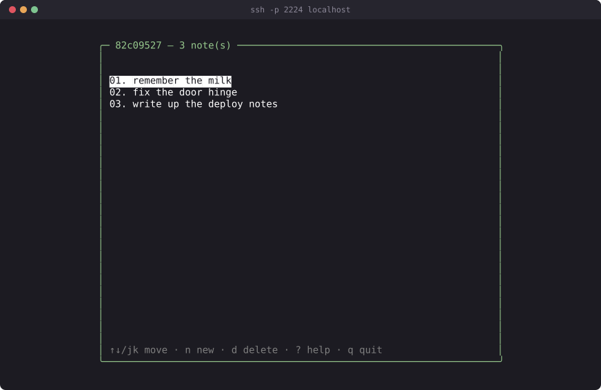
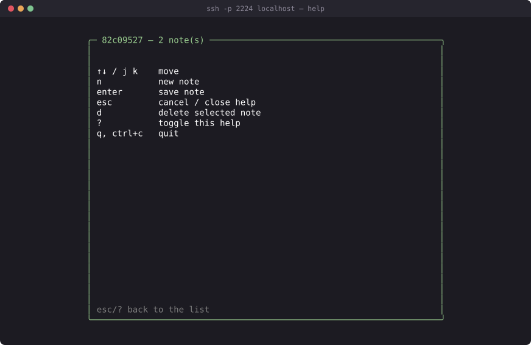

# A multi-view notes app

This tutorial builds [`examples/notes/main.odin`](../examples/notes/main.odin)
— a private scratchpad, one per SSH key, served to as many people as connect
at once. It's the natural sequel to
[`tutorial-first-app.md`](./tutorial-first-app.md): where `whoami` shows you
one screen, `notes` is three, switched between at runtime, and where `whoami`
only shows you your own connection's `Info`, `notes` uses it to give every
key its own private, reconnect-durable state.



That screenshot, like every one in these docs, is a real capture — a real
`ssh` client, driven by `docs/tools/capture.py`, typing those notes into the
finished app.

Read [`tutorial-first-app.md`](./tutorial-first-app.md) first if you haven't
— this page assumes you already know what `create`/`update`/`view` are and
why `view` paints a whole frame every tick. It leans on
[`cookbook.md`](./cookbook.md) throughout, citing the specific recipe each
new idea comes from rather than re-deriving it, and on
[`security.md`](./security.md) for the identity story behind `Info.id`.

Five stages: a static frame, a scrollable list, a compose view, real
per-user state shared across reconnects, and the delete/help/polish pass
that gets you to the shipped file. Work inside your otsh checkout, editing
`examples/notes/main.odin` directly, and build with:

```sh
./build.sh examples/notes
./notes
```

Then, from another terminal:

```sh
ssh -p 2224 localhost
```

Port 2224 is arbitrary — chosen only to not collide with the other bundled
examples (`tracker` 2222, `whoami` 2223, `members` 2226, `guestbook` 2228).

## 1. A served window that draws a static frame

Start exactly where `tutorial-first-app.md` did: the three-proc skeleton,
one box, nothing dynamic yet.

<!-- check:file -->
```odin
package main

import "core:os"
import "otsh:sshtui"
import "otsh:tui"

Model :: struct {}

update :: proc(p: ^tui.Program, msg: tui.Msg) {
	#partial switch e in msg {
	case tui.Key:
		if e.kind == .Esc || (e.kind == .Rune && e.r == 'q') {
			tui.quit(p)
		}
	}
}

view :: proc(p: ^tui.Program, sc: ^tui.Screen) {
	tui.draw_box(sc, 2, 1, 40, 6, tui.Style{fg = tui.rgb(150, 200, 140)}, tui.BORDER_ROUND, " notes ")
	tui.draw_text(sc, 4, 3, "your notes will go here", tui.Style{})
	tui.draw_text(sc, 4, 4, "q to quit", tui.Style{fg = tui.ansi(8)})
}

create :: proc(info: sshtui.Info) -> tui.App {
	return tui.App{data = new(Model), update = update, view = view}
}

destroy :: proc(app: tui.App) {
	free(app.data)
}

main :: proc() {
	cfg := sshtui.Config {
		port          = 2224,
		host_key_path = "notes_hostkey",
		create        = create,
		destroy       = destroy,
	}

	if !sshtui.serve(cfg) {
		os.exit(1)
	}
}
```

`tui.rgb(150, 200, 140)` is a muted green, chosen only to look different from
`whoami`'s cyan and `guestbook`'s blue in a terminal running more than one of
these at once — there's no significance to the exact numbers beyond that.

**Checkpoint.** Build and connect:

```sh
./build.sh examples/notes
./notes
ssh -p 2224 localhost
```

You should see one rounded box titled " notes " near the top-left corner,
containing "your notes will go here" and "q to quit," and nothing else.
`q`/`Esc` end the session cleanly, same as every other example.

## 2. The List view, with a cursor and scrolling

A notes app with nothing to scroll through isn't proving anything, so give
`Model` a list, a cursor, and the same offset-tracking viewport
`docs/cookbook.md` recipe 1 walks through for `examples/tracker`. Seed a few
notes by hand for now — real per-user notes are stage 4's problem, not this
one's:

<!-- check:file -->
```odin
package main

import "core:os"
import "otsh:sshtui"
import "otsh:tui"

Note :: struct {
	text: string,
}

Model :: struct {
	notes:  [dynamic]Note,
	cursor: int,
	offset: int, // index of the first visible row
}

Layout :: struct {
	box_x, box_y, box_w, box_h:     int,
	list_x, list_y, list_w, list_h: int,
}

compute_layout :: proc(w, h: int) -> Layout {
	l: Layout
	l.box_w = min(w - 4, 70)
	l.box_x = (w - l.box_w) / 2
	l.box_y = 1
	l.box_h = h - 2
	l.list_x = l.box_x + 2
	l.list_y = l.box_y + 3
	l.list_w = max(l.box_w - 4, 1)
	l.list_h = max(l.box_h - 6, 1)
	return l
}

move_cursor :: proc(m: ^Model, delta, n, viewport_h: int) {
	if n == 0 {
		m.cursor, m.offset = 0, 0
		return
	}
	m.cursor = clamp(m.cursor + delta, 0, n - 1)
	clamp_scroll(m, n, viewport_h)
}

clamp_scroll :: proc(m: ^Model, n, viewport_h: int) {
	if n == 0 {
		m.cursor, m.offset = 0, 0
		return
	}
	if m.cursor >= n {
		m.cursor = n - 1
	}
	if m.cursor < m.offset {
		m.offset = m.cursor
	}
	if m.cursor >= m.offset + viewport_h {
		m.offset = m.cursor - viewport_h + 1
	}
	if m.offset < 0 {
		m.offset = 0
	}
}

update :: proc(p: ^tui.Program, msg: tui.Msg) {
	m := (^Model)(p.app.data)
	#partial switch e in msg {
	case tui.Key:
		if e.kind == .Esc || (e.kind == .Rune && e.r == 'q') {
			tui.quit(p)
			return
		}
		l := compute_layout(p.screen.w, p.screen.h)
		n := len(m.notes)
		#partial switch e.kind {
		case .Up:
			move_cursor(m, -1, n, l.list_h)
		case .Down:
			move_cursor(m, 1, n, l.list_h)
		case .Rune:
			switch e.r {
			case 'k':
				move_cursor(m, -1, n, l.list_h)
			case 'j':
				move_cursor(m, 1, n, l.list_h)
			}
		}
	}
}

view :: proc(p: ^tui.Program, sc: ^tui.Screen) {
	defer free_all(context.temp_allocator)
	m := (^Model)(p.app.data)

	l := compute_layout(sc.w, sc.h)
	tui.draw_box(sc, l.box_x, l.box_y, l.box_w, l.box_h, tui.Style{fg = tui.rgb(150, 200, 140)}, tui.BORDER_ROUND, " notes ")

	for row in 0 ..< l.list_h {
		i := m.offset + row
		if i >= len(m.notes) {
			break
		}
		st := tui.Style{fg = tui.ansi(15)}
		if i == m.cursor {
			st.attrs = {.Reverse}
		}
		tui.draw_text_clipped(sc, l.list_x, l.list_y + row, l.list_w, m.notes[i].text, st)
	}
}

create :: proc(info: sshtui.Info) -> tui.App {
	m := new(Model)
	m.notes = make([dynamic]Note, 0, 8)
	append(&m.notes, Note{"buy stamps"}, Note{"call the plumber"}, Note{"read the cookbook"})
	return tui.App{data = m, update = update, view = view}
}

destroy :: proc(app: tui.App) {
	m := (^Model)(app.data)
	delete(m.notes)
	free(app.data)
}

main :: proc() {
	cfg := sshtui.Config {
		port          = 2224,
		host_key_path = "notes_hostkey",
		create        = create,
		destroy       = destroy,
	}

	if !sshtui.serve(cfg) {
		os.exit(1)
	}
}
```

`compute_layout` returns one struct of coordinates instead of scattering the
same arithmetic across `update` and `view` — the same discipline
`tutorial-first-app.md` used for centering `whoami`'s box, extended here
because two different procs (`update`, for scrolling math, and `view`, for
drawing) both need the list's height, and `docs/cookbook.md` recipe 1 is
explicit about what happens the moment those two computations disagree: the
cursor and the visible window drift apart, silently.

`move_cursor`/`clamp_scroll` are close to a direct copy of the recipe: move
the cursor, then pull the scroll offset along only as far as it takes to
keep the cursor on screen. `clamp_scroll` is also its own proc, not folded
into `move_cursor`, because stage 4 needs to call it on its own — the count
of notes can change for reasons that have nothing to do with a keypress
(another session deleting one, or, later, a resize).

The three seed notes and the plain `delete(m.notes)` in `destroy` are both
temporary. Real notes don't exist yet — that's stage 4 — and once they do,
`Note.text` becomes an owned string that has to be freed individually. Stage
2 doesn't allocate one, so there's nothing yet to leak.

**Checkpoint.** Rebuild and reconnect. You should see the same box, now
containing three lines — "buy stamps," "call the plumber," "read the
cookbook" — with the first one highlighted. `↑`/`↓`/`j`/`k` should move the
highlight between all three without running off either end.

## 3. The Edit view, and view-enum dispatch

Reading is half the app. The other half needs a second view — one where
keys build up a line of text instead of moving a cursor — which means a
`View` enum and the "one enum, picked twice" pattern `docs/cookbook.md`
recipe 2 documents for `examples/tracker`: `update` dispatches key handling
on `m.view`, `view` dispatches drawing on the same value.

Add the enum, extend `Model` with a view field and an input buffer, and add
the compose-mode key handler and its supporting procs:

<!-- check:decls -->
```odin
Note :: struct {
	text: string, // owned
}

View :: enum {
	List,
	Edit,
}

MAX_NOTE_BYTES :: 240

Model :: struct {
	notes:   [dynamic]Note,
	view:    View,
	cursor:  int,
	offset:  int,
	buf:     [MAX_NOTE_BYTES]u8,
	buf_len: int,
}

insert_rune :: proc(m: ^Model, r: rune) {
	b, n := utf8.encode_rune(r)
	if m.buf_len + n <= len(m.buf) {
		copy(m.buf[m.buf_len:], b[:n])
		m.buf_len += n
	}
}

commit_note :: proc(m: ^Model) {
	text := strings.trim_space(string(m.buf[:m.buf_len]))
	if text != "" {
		append(&m.notes, Note{text = strings.clone(text)})
	}
	m.buf_len = 0
	m.view = .List
}

key_edit :: proc(m: ^Model, k: tui.Key) {
	#partial switch k.kind {
	case .Enter:
		commit_note(m)
	case .Esc:
		m.buf_len = 0
		m.view = .List
	case .Backspace:
		if m.buf_len > 0 {
			_, size := utf8.decode_last_rune(m.buf[:m.buf_len])
			m.buf_len -= max(size, 1)
		}
	case .Space:
		insert_rune(m, ' ')
	case .Rune:
		insert_rune(m, k.r)
	}
}
```

This is `docs/cookbook.md` recipe 3, the text-input pattern, applied
directly: `.Backspace` steps back one *rune*, not one byte, via
`utf8.decode_last_rune`, or a multi-byte character typed into a note would
leave a broken tail behind; `.Space` is handled separately from `.Rune`
because Space is its own `Key_Kind` and never reaches the `.Rune` case at
all; and `commit_note` clones the text out of `m.buf` before storing it,
because `m.buf` is about to be reused for whatever gets typed next.

Two things change outside this new block, both small. `key_list` gains one
case, so `n` for a new note enters `Edit`:

<!-- check:verbatim examples/notes/main.odin -->
```odin
		case 'n':
			m.view = .Edit
			m.buf_len = 0
```

And `update`/`view` each grow a `switch m.view` — `update` dispatching to
`key_list` or `key_edit`, `view` still drawing the list underneath but now
also drawing a footer that differs by mode: the ordinary help text in
`List`, or the line being typed plus a real cursor in `Edit`, via
`tui.set_cursor` — recipe 3 again, and the same "call it every frame or it
doesn't show" rule `tutorial-first-app.md` never needed because `whoami` has
no input field at all. Nothing here is new beyond wiring `key_edit` into
that dispatch and drawing one more line in `view`, so it isn't reprinted —
stage 4 shows the whole file's `view` in a shape that's much closer to
final, and stage 5 shows the exact one.

**Checkpoint.** Rebuild, reconnect, press `n`, type a line, press `Enter`.
Your line should appear at the bottom of the list. Press `n` again, type
something, and press `Esc` instead — nothing should be added. This is still
a single-player notes app: disconnect and reconnect and you'll find the same
three seed notes, not what you typed a moment ago. That's stage 4.

## 4. Per-user state — identity, the mutex, and the map-key trap

**This is the important stage.** Everything before it kept its notes on a
`Model` that `create` allocates fresh per connection — reconnecting with the
same key, or opening a second session, gets you a brand-new empty list every
time. A notes app nobody's notes survive a reconnect isn't one.

The reason this needs real care, not just moving a variable, is the
connection model `docs/cookbook.md` recipe 8 describes: `sshtui.Create_Proc`
runs once per connection, **on that connection's own thread**
(`ssh/server.odin` spawns one per accepted session). State that has to
outlive a single connection — here, one user's list of notes — can't live on
that connection's `Model`; it has to live at package scope, reachable from
every connection's thread at once, which means a `sync.Mutex` around every
read and write.

Unlike `examples/members`' roster (recipe 8's running example, one flat
`map[string]Member`), `notes` needs a *list per user*. Wrap it:

<!-- check:verbatim examples/notes/main.odin -->
```odin
Note :: struct {
	text: string, // owned
}

User_Notes :: struct {
	notes: [dynamic]Note,
}

notes_store: map[string]User_Notes
notes_mu: sync.Mutex
```

and the read side — a count and a by-index lookup, both locked, both
returning a value rather than a pointer into the map so nothing holds the
lock past the call that needed it:

<!-- check:verbatim examples/notes/main.odin -->
```odin
notes_count :: proc(id: string) -> int {
	sync.lock(&notes_mu)
	defer sync.unlock(&notes_mu)
	u, ok := notes_store[id]
	return ok ? len(u.notes) : 0
}

// Returns a copy of note i whose text is cloned into the temp allocator.
notes_at :: proc(id: string, i: int) -> (Note, bool) {
	sync.lock(&notes_mu)
	defer sync.unlock(&notes_mu)
	u, ok := notes_store[id]
	if !ok || i < 0 || i >= len(u.notes) {
		return {}, false
	}
	return Note{text = strings.clone(u.notes[i].text, context.temp_allocator)}, true
}
```

That `strings.clone(..., context.temp_allocator)` on the way out deserves a
pause, because the version without it — `return u.notes[i], true` — looks
identical in every test you can run at this stage and is a use-after-free
waiting for the next one. The returned `Note` carries a `string`, and a
string is a pointer into bytes the *store* owns. Today nothing ever frees
those bytes, so borrowing them past the unlock is harmless — which is
exactly why `examples/guestbook`'s `message_at` returns its strings
borrowed: a guestbook only ever appends. But stage 5 adds `d`, and the
moment one session with your key can free a note's text while another
session with the same key is drawing it, a borrowed return is a cross-thread
use-after-free with a window the width of one frame. Cloning under the lock,
into the temp allocator that `view`'s `defer free_all(context.temp_allocator)`
already empties every frame, closes it for the price of one short-lived copy.

Now the part `docs/cookbook.md` recipe 8 calls "the gotcha the mutex alone
doesn't cover." `Info.id` is a `string` backed by the connection's own
buffer, which is zeroed and freed the moment that connection's thread tears
down. Store the `id` you were handed straight into `notes_store` as a map
key, and the moment that one connection ends, the key you inserted points at
freed memory — every other session's lookup against that same identity now
either misses or reads garbage. The fix is: clone the key, but only once,
the first time you see it — because assigning to a key *already* in a map
updates the value and leaves the stored key alone, so every visit after the
first can safely reuse the caller's borrowed `id`:

<!-- check:verbatim examples/notes/main.odin -->
```odin
notes_add :: proc(id: string, text: string) -> bool {
	sync.lock(&notes_mu)
	defer sync.unlock(&notes_mu)

	u, existed := notes_store[id]
	if !existed {
		u = User_Notes{notes = make([dynamic]Note, 0, 8)}
	}
	if len(u.notes) >= MAX_NOTES {
		return false
	}
	append(&u.notes, Note{text = strings.clone(text)})

	if existed {
		// Assigning to a key already in the map updates the value and
		// leaves the stored key alone, so the borrowed `id` is fine here.
		// docs/cookbook.md §8.
		notes_store[id] = u
	} else {
		// First note from this user: the map key must outlive the
		// connection that handed us `id`, so it gets its own clone, made
		// exactly once, right here on insert. Every later access reuses
		// the caller's borrowed id — only the insert owns a key.
		notes_store[strings.clone(id)] = u
	}
	return true
}
```

Get this backwards — clone on every call, say, or never clone at all — and
you get one of two failures that both look fine in casual testing. Clone
every time and you leak one string per note, forever, since nothing ever
frees the old key. Never clone and the app usually still "works," because
`id_buf` is zeroed rather than freed onto reused memory in this codebase, so
a stale key tends to read back as blank rather than as another user's
identity — but "tends to" is not a guarantee you should be running a server
on, which is exactly why recipe 8 spells the mechanism out instead of
leaving it as folklore. `MAX_NOTES` bounds each user's list for the same
reason `examples/guestbook`'s `MAX_MESSAGES` exists: shared state reachable
by anyone with a key has to be bounded, or one connection can grow the
process's memory without limit, and the cap has to be checked under the same
lock as the `append`, or two sessions racing for a user's last slot could
both pass.

With the shared store in place, `Model` no longer holds the notes
themselves — it holds the identity that keys them:

<!-- check:verbatim examples/notes/main.odin -->
```odin
Model :: struct {
	id:      string, // owned; cloned from Info.id, keys the shared store
	who:     string, // owned; short display label — first 8 chars of id
	view:    View,
	cursor:  int,
	offset:  int, // index of the first visible row
	buf:     [MAX_NOTE_BYTES]u8,
	buf_len: int,
}
```

`create` and `destroy` clone what they need and free it, the same shape
`examples/guestbook` uses for its own per-connection display label:

<!-- check:verbatim examples/notes/main.odin -->
```odin
create :: proc(info: sshtui.Info) -> tui.App {
	m := new(Model)
	// methods = {.Publickey} plus identity_secret below means info.id is
	// always non-empty by the time create runs — see docs/security.md §3.
	m.id = strings.clone(info.id)
	m.who = strings.clone(info.id[:min(len(info.id), 8)])
	return tui.App{data = m, update = update, view = view}
}

// Frees only the per-connection Model — notes_store deliberately outlives
// every connection, so it is not touched here.
destroy :: proc(app: tui.App) {
	m := (^Model)(app.data)
	delete(m.id)
	delete(m.who)
	free(app.data)
}
```

`m.id` is only non-empty at all because `main` is about to set
`identity_secret` and `methods = {.Publickey}` together — without a key
offered, there's no fingerprint to derive an id from; without
`{.Publickey}` forcing a key, an OpenSSH client authenticates via `none`
before ever offering one (`security.md` §3):

<!-- check:verbatim examples/notes/main.odin -->
```odin
		identity_secret = "notes_secret", // enables Info.id
		// Otherwise an OpenSSH client authenticates via "none" before ever
		// offering a key, and Info.id stays empty. docs/security.md §3.
		methods         = {.Publickey},
```

`commit_note` now writes through `notes_add` instead of appending to a local
slice — the same "nobody touches the shared variable except through a
function that locks first" discipline `tutorial-guestbook.md` names as the
whole technique:

<!-- check:verbatim examples/notes/main.odin -->
```odin
commit_note :: proc(m: ^Model) {
	text := strings.trim_space(string(m.buf[:m.buf_len]))
	if text != "" {
		notes_add(m.id, text)
	}
	m.buf_len = 0
	m.view = .List
}
```

and `key_list`'s note count now comes from the shared store, keyed by this
connection's identity, not from a field on `Model` that no longer exists:

<!-- check:verbatim examples/notes/main.odin -->
```odin
	n := notes_count(m.id)
```

`draw_list` reads the same way — one `notes_at(m.id, i)` call per visible
row instead of indexing a local slice, which is also, unchanged, exactly
what stage 5 ships:

<!-- check:verbatim examples/notes/main.odin -->
```odin
draw_list :: proc(sc: ^tui.Screen, m: ^Model, l: Layout, n: int) {
	if n == 0 {
		empty := "no notes yet — press n to write one"
		tui.draw_text_clipped(sc, l.list_x, l.list_y, l.list_w, empty, tui.Style{fg = tui.ansi(8), attrs = {.Italic}})
		return
	}
	for row in 0 ..< l.list_h {
		i := m.offset + row
		if i >= n {
			break
		}
		note, ok := notes_at(m.id, i)
		if !ok {
			break
		}
		st := tui.Style{fg = tui.ansi(15)}
		if m.view == .List && i == m.cursor {
			st.attrs = {.Reverse}
		}
		prefix := fmt.tprintf("%2d. ", i + 1)
		used := tui.draw_text_clipped(sc, l.list_x, l.list_y + row, l.list_w, prefix, st)
		if used < l.list_w {
			tui.draw_text_clipped(sc, l.list_x + used, l.list_y + row, l.list_w - used, note.text, st)
		}
	}
}
```

Last, `main` allocates the map before `serve` starts accepting anyone:

<!-- check:verbatim examples/notes/main.odin -->
```odin
	notes_store = make(map[string]User_Notes)
```

**Checkpoint.** Rebuild, restart the server, and open two terminals side by
side, both `ssh -p 2224 localhost` with the *same* key. Press `n` in one,
write a note, press `Enter` — and watch it appear in the other window on its
own, within a frame. No push machinery makes that happen: the second
session's `view` runs every tick whether or not you type, and every tick it
asks the shared store for this identity's notes, so the moment `notes_add`
commits under the lock, the next frame anywhere sees it and the diff
renderer sends just the new line. (Measured while writing this page: an idle
watching session received exactly one small burst — the new row plus the
changed note-count in the title, under a hundred bytes — in the same second
the writer pressed Enter.) Quit and reconnect and it's still there, which is
the part reconnect-durability adds on top. Now connect with a *different*
key (`ssh -i /path/to/other/key -p 2224 localhost` if you have a second one
handy) and you should see an empty list — a different identity, a different
entry in `notes_store`, exactly as `docs/cookbook.md` recipe 8 says it
should.

## 5. Delete, Help, and the polish pass

Three things separate what you have from the shipped file: a way to remove
a note, a keybinding reference, and the two guards every bundled example
past `whoami`'s size carries — a resize handler and a too-small floor.

Deleting locks, checks bounds, frees the owned string, and closes the gap in
the slice with `ordered_remove` — a builtin, not something from `core:slice`
— before writing the shortened header back to the map (`id` is only
borrowed here; the entry already exists, so recipe 8's "existing key" case
applies, not the "first insert" one):

<!-- check:verbatim examples/notes/main.odin -->
```odin
// Deletes note i for this user. False if there is no such note.
notes_delete :: proc(id: string, i: int) -> bool {
	sync.lock(&notes_mu)
	defer sync.unlock(&notes_mu)
	u, ok := notes_store[id]
	if !ok || i < 0 || i >= len(u.notes) {
		return false
	}
	delete(u.notes[i].text)
	ordered_remove(&u.notes, i)
	notes_store[id] = u // id is only borrowed; see notes_add above
	return true
}
```

That `delete(u.notes[i].text)` is also the line stage 4's `notes_at` was
built to survive: from here on, a note's bytes can be freed by one session
while another session with the same key is mid-frame, which is exactly why
`notes_at` hands out a temp-allocator clone instead of the stored string.

`View` gains a third member, and `key_list` gains the two keys that use it —
`d` to delete whatever's under the cursor, re-clamping the scroll afterward
in case that was the last row on screen, and `?` to open it:

<!-- check:verbatim examples/notes/main.odin -->
```odin
View :: enum {
	List, // your notes, with a cursor
	Edit, // composing a new note
	Help, // keybindings
}
```

<!-- check:verbatim examples/notes/main.odin -->
```odin
		case 'd':
			if notes_delete(m.id, m.cursor) {
				clamp_scroll(m, notes_count(m.id), l.list_h)
			}
		case '?':
			m.view = .Help
```

`Help`'s own key handling is one line — `Esc` or `?` again both close it —
which is why it doesn't get the same `#partial switch` treatment
`key_list`/`key_edit` do; there's nothing to switch on beyond the one
condition:

<!-- check:verbatim examples/notes/main.odin -->
```odin
key_help :: proc(m: ^Model, k: tui.Key) {
	if k.kind == .Esc || (k.kind == .Rune && k.r == '?') {
		m.view = .List
	}
}
```

Drawing it is a fixed table of key/action pairs, clipped to however many
fit above the footer — the same "don't draw past the space you have" care
`draw_list` already takes, applied to a list that never scrolls because it's
short enough not to need to:

<!-- check:verbatim examples/notes/main.odin -->
```odin
draw_help :: proc(sc: ^tui.Screen, l: Layout) {
	lines := [?]string {
		"↑↓ / j k    move",
		"n           new note",
		"enter       save note",
		"esc         cancel / close help",
		"d           delete selected note",
		"?           toggle this help",
		"q, ctrl+c   quit",
	}
	for line, i in lines {
		y := l.list_y + i
		if y >= l.footer_y {
			break
		}
		tui.draw_text_clipped(sc, l.list_x, y, l.list_w, line, tui.Style{fg = tui.ansi(15)})
	}
}
```

`view` picks `draw_help` or `draw_list` by mode, and `draw_footer` grows a
third case to match — one string per row, chosen by an `if`/`switch` before
drawing, never two calls layered on the same row, which is the specific
mistake `docs/cookbook.md` recipe 7 walks through under a toast that
overprinted a longer help line it didn't fully erase:

<!-- check:verbatim examples/notes/main.odin -->
```odin
draw_footer :: proc(sc: ^tui.Screen, m: ^Model, l: Layout) {
	switch m.view {
	case .List:
		help := "↑↓/jk move · n new · d delete · ? help · q quit"
		tui.draw_text_clipped(sc, l.list_x, l.footer_y, l.list_w, help, tui.Style{fg = tui.ansi(8)})
	case .Help:
		tui.draw_text_clipped(sc, l.list_x, l.footer_y, l.list_w, "esc/? back to the list", tui.Style{fg = tui.ansi(8)})
	case .Edit:
		text := string(m.buf[:m.buf_len])
		line := fmt.tprintf("> %s", text)
		tui.draw_text_clipped(sc, l.list_x, l.footer_y, l.list_w, line, tui.Style{fg = tui.ansi(15)})
		tui.set_cursor(sc, l.list_x + tui.text_width("> ") + tui.text_width(text), l.footer_y)
	}
}
```

Last, the two guards `docs/cookbook.md` recipe 5 covers. A resize doesn't
need `view` to do anything — `tui.run` has already resized `Screen` by the
time `view` runs — but a scroll offset computed against the *old* height is
still that old number, so `update` re-clamps it against the new one:

<!-- check:verbatim examples/notes/main.odin -->
```odin
	case tui.Resize:
		l := compute_layout(e.cols, e.rows)
		clamp_scroll(m, notes_count(m.id), l.list_h)
```

And below some minimum, `view` doesn't try to lay out the real UI at all —
one centered, clipped line explaining why, and nothing else, the same
`MIN_W`/`MIN_H` shape `tutorial-first-app.md` didn't need but
`examples/guestbook` and `examples/tracker` both do:

<!-- check:verbatim examples/notes/main.odin -->
```odin
	if sc.w < MIN_W || sc.h < MIN_H {
		msg := fmt.tprintf("terminal too small — need %dx%d, have %dx%d", MIN_W, MIN_H, sc.w, sc.h)
		x := max((sc.w - tui.text_width(msg)) / 2, 0)
		tui.draw_text_clipped(sc, x, sc.h / 2, sc.w, msg, tui.Style{fg = tui.ansi(11)})
		return
	}
```

**Checkpoint.** Rebuild and reconnect. `?` should open a full-screen list of
every key this app understands; `Esc` or `?` again should return you to your
notes:



(That capture is from a *reconnection* — the title bar says 2 notes because
the session before it wrote three and this one deleted one. Persistence
across reconnects is stage 4 working.) With a couple of notes on screen, `d` should remove whichever one is
under the cursor and shift the rest up to fill the gap. Shrinking the
terminal below roughly 44 columns or 14 rows should replace the whole UI
with one centered sentence naming the size you need; growing it back should
restore the normal view, correctly laid out for the new size.

## The complete `main.odin`

This is exactly what's in `examples/notes/main.odin` — every piece from the
five stages above, assembled:

<!-- check:verbatim examples/notes/main.odin -->
```odin
// notes — a private scratchpad per SSH key, served to many users at once.
//
// Every key gets its own list of notes. Reconnect with the same key later in
// the same server run and they're still there; restart the server and
// they're gone — nothing here is ever written to disk. See
// docs/tutorial-notes.md, "what to try next", for how you'd add that.
//
//	./build.sh examples/notes && ./notes
//	ssh -p 2224 localhost
package main

import "core:fmt"
import "core:os"
import "core:strings"
import "core:sync"
import "core:unicode/utf8"
import "otsh:sshtui"
import "otsh:tui"

// ---------------------------------------------------------------------------
// Shared state. Every connection runs on its own thread, so the notes live
// at package scope guarded by a mutex, like examples/members' roster —
// keyed per user instead of shared by everyone. destroy (below) frees only
// the per-connection Model; this map outlives every connection on purpose.

Note :: struct {
	text: string, // owned
}

User_Notes :: struct {
	notes: [dynamic]Note,
}

notes_store: map[string]User_Notes
notes_mu: sync.Mutex

// Bounded per user, checked under the same lock as the append below, or two
// sessions racing for the last slot could both pass.
MAX_NOTES :: 200

notes_count :: proc(id: string) -> int {
	sync.lock(&notes_mu)
	defer sync.unlock(&notes_mu)
	u, ok := notes_store[id]
	return ok ? len(u.notes) : 0
}

// Returns a copy of note i whose text is cloned into the temp allocator.
// Returning the stored string itself would be a use-after-free waiting to
// happen: the moment the lock drops, another session with the same key can
// press d and notes_delete frees those bytes while the caller is still
// drawing them. (guestbook can return its strings borrowed because nothing
// there ever deletes one; here d exists.) view()'s frame-end
// free_all(context.temp_allocator) reclaims the clone.
notes_at :: proc(id: string, i: int) -> (Note, bool) {
	sync.lock(&notes_mu)
	defer sync.unlock(&notes_mu)
	u, ok := notes_store[id]
	if !ok || i < 0 || i >= len(u.notes) {
		return {}, false
	}
	return Note{text = strings.clone(u.notes[i].text, context.temp_allocator)}, true
}

// Clones text before storing it — it usually points into a per-connection
// buffer (Model.buf) the next keystroke overwrites. False at MAX_NOTES.
notes_add :: proc(id: string, text: string) -> bool {
	sync.lock(&notes_mu)
	defer sync.unlock(&notes_mu)

	u, existed := notes_store[id]
	if !existed {
		u = User_Notes{notes = make([dynamic]Note, 0, 8)}
	}
	if len(u.notes) >= MAX_NOTES {
		return false
	}
	append(&u.notes, Note{text = strings.clone(text)})

	if existed {
		// Assigning to a key already in the map updates the value and
		// leaves the stored key alone, so the borrowed `id` is fine here.
		// docs/cookbook.md §8.
		notes_store[id] = u
	} else {
		// First note from this user: the map key must outlive the
		// connection that handed us `id`, so it gets its own clone, made
		// exactly once, right here on insert. Every later access reuses
		// the caller's borrowed id — only the insert owns a key.
		notes_store[strings.clone(id)] = u
	}
	return true
}

// Deletes note i for this user. False if there is no such note.
notes_delete :: proc(id: string, i: int) -> bool {
	sync.lock(&notes_mu)
	defer sync.unlock(&notes_mu)
	u, ok := notes_store[id]
	if !ok || i < 0 || i >= len(u.notes) {
		return false
	}
	delete(u.notes[i].text)
	ordered_remove(&u.notes, i)
	notes_store[id] = u // id is only borrowed; see notes_add above
	return true
}

// ---------------------------------------------------------------------------
// Per-connection state.

View :: enum {
	List, // your notes, with a cursor
	Edit, // composing a new note
	Help, // keybindings
}

MAX_NOTE_BYTES :: 240

Model :: struct {
	id:      string, // owned; cloned from Info.id, keys the shared store
	who:     string, // owned; short display label — first 8 chars of id
	view:    View,
	cursor:  int,
	offset:  int, // index of the first visible row
	buf:     [MAX_NOTE_BYTES]u8,
	buf_len: int,
}

move_cursor :: proc(m: ^Model, delta, n, viewport_h: int) {
	if n == 0 {
		m.cursor, m.offset = 0, 0
		return
	}
	m.cursor = clamp(m.cursor + delta, 0, n - 1)
	clamp_scroll(m, n, viewport_h)
}

// Keeps cursor/offset consistent when the note count or viewport height
// changes underneath us. docs/cookbook.md recipe 1.
clamp_scroll :: proc(m: ^Model, n, viewport_h: int) {
	if n == 0 {
		m.cursor, m.offset = 0, 0
		return
	}
	if m.cursor >= n {
		m.cursor = n - 1
	}
	if m.cursor < m.offset {
		m.offset = m.cursor
	}
	if m.cursor >= m.offset + viewport_h {
		m.offset = m.cursor - viewport_h + 1
	}
	if m.offset < 0 {
		m.offset = 0
	}
}

insert_rune :: proc(m: ^Model, r: rune) {
	b, n := utf8.encode_rune(r)
	if m.buf_len + n <= len(m.buf) {
		copy(m.buf[m.buf_len:], b[:n])
		m.buf_len += n
	}
}

commit_note :: proc(m: ^Model) {
	text := strings.trim_space(string(m.buf[:m.buf_len]))
	if text != "" {
		notes_add(m.id, text)
	}
	m.buf_len = 0
	m.view = .List
}

// ---------------------------------------------------------------------------
// Layout. One set of numbers, used by both update() and view(), so the two
// never disagree about the list height. docs/cookbook.md recipe 1.

MIN_W :: 44
MIN_H :: 14

Layout :: struct {
	box_x, box_y, box_w, box_h:     int,
	list_x, list_y, list_w, list_h: int,
	footer_y:                       int,
}

compute_layout :: proc(w, h: int) -> Layout {
	l: Layout
	l.box_w = min(w - 4, 70)
	l.box_x = (w - l.box_w) / 2
	l.box_y = 1
	l.box_h = h - 2
	l.list_x = l.box_x + 2
	l.list_y = l.box_y + 3
	l.list_w = max(l.box_w - 4, 1)
	l.list_h = max(l.box_h - 6, 1)
	l.footer_y = l.box_y + 4 + l.list_h
	return l
}

// ---------------------------------------------------------------------------
// update

update :: proc(p: ^tui.Program, msg: tui.Msg) {
	m := (^Model)(p.app.data)

	#partial switch e in msg {
	case tui.Key:
		// Ctrl+C is a key here, not a signal — docs/cookbook.md recipe 12.
		if e.ctrl && e.r == 'c' {
			tui.quit(p)
			return
		}
		switch m.view {
		case .List:
			key_list(p, m, e)
		case .Edit:
			key_edit(m, e)
		case .Help:
			key_help(m, e)
		}

	case tui.Resize:
		l := compute_layout(e.cols, e.rows)
		clamp_scroll(m, notes_count(m.id), l.list_h)
	}
}

key_list :: proc(p: ^tui.Program, m: ^Model, k: tui.Key) {
	if k.kind == .Esc || (k.kind == .Rune && k.r == 'q') {
		tui.quit(p)
		return
	}
	l := compute_layout(p.screen.w, p.screen.h)
	n := notes_count(m.id)

	#partial switch k.kind {
	case .Up:
		move_cursor(m, -1, n, l.list_h)
	case .Down:
		move_cursor(m, 1, n, l.list_h)
	case .Rune:
		switch k.r {
		case 'k':
			move_cursor(m, -1, n, l.list_h)
		case 'j':
			move_cursor(m, 1, n, l.list_h)
		case 'n':
			m.view = .Edit
			m.buf_len = 0
		case 'd':
			if notes_delete(m.id, m.cursor) {
				clamp_scroll(m, notes_count(m.id), l.list_h)
			}
		case '?':
			m.view = .Help
		}
	}
}

key_edit :: proc(m: ^Model, k: tui.Key) {
	#partial switch k.kind {
	case .Enter:
		commit_note(m)
	case .Esc:
		m.buf_len = 0
		m.view = .List
	case .Backspace:
		// A whole rune, not a byte — multi-byte input otherwise leaves a
		// broken tail behind. docs/cookbook.md recipe 3.
		if m.buf_len > 0 {
			_, size := utf8.decode_last_rune(m.buf[:m.buf_len])
			m.buf_len -= max(size, 1)
		}
	case .Space:
		insert_rune(m, ' ')
	case .Rune:
		insert_rune(m, k.r)
	}
}

key_help :: proc(m: ^Model, k: tui.Key) {
	if k.kind == .Esc || (k.kind == .Rune && k.r == '?') {
		m.view = .List
	}
}

// ---------------------------------------------------------------------------
// view

view :: proc(p: ^tui.Program, sc: ^tui.Screen) {
	defer free_all(context.temp_allocator)
	m := (^Model)(p.app.data)

	if sc.w < MIN_W || sc.h < MIN_H {
		msg := fmt.tprintf("terminal too small — need %dx%d, have %dx%d", MIN_W, MIN_H, sc.w, sc.h)
		x := max((sc.w - tui.text_width(msg)) / 2, 0)
		tui.draw_text_clipped(sc, x, sc.h / 2, sc.w, msg, tui.Style{fg = tui.ansi(11)})
		return
	}

	l := compute_layout(sc.w, sc.h)
	n := notes_count(m.id)
	clamp_scroll(m, n, l.list_h)

	title := fmt.tprintf(" %s — %d note(s) ", m.who, n)
	tui.draw_box(sc, l.box_x, l.box_y, l.box_w, l.box_h, tui.Style{fg = tui.rgb(150, 200, 140)}, tui.BORDER_ROUND, title)

	if m.view == .Help {
		draw_help(sc, l)
	} else {
		draw_list(sc, m, l, n)
	}
	draw_footer(sc, m, l)
}

draw_list :: proc(sc: ^tui.Screen, m: ^Model, l: Layout, n: int) {
	if n == 0 {
		empty := "no notes yet — press n to write one"
		tui.draw_text_clipped(sc, l.list_x, l.list_y, l.list_w, empty, tui.Style{fg = tui.ansi(8), attrs = {.Italic}})
		return
	}
	for row in 0 ..< l.list_h {
		i := m.offset + row
		if i >= n {
			break
		}
		note, ok := notes_at(m.id, i)
		if !ok {
			break
		}
		st := tui.Style{fg = tui.ansi(15)}
		if m.view == .List && i == m.cursor {
			st.attrs = {.Reverse}
		}
		prefix := fmt.tprintf("%2d. ", i + 1)
		used := tui.draw_text_clipped(sc, l.list_x, l.list_y + row, l.list_w, prefix, st)
		if used < l.list_w {
			tui.draw_text_clipped(sc, l.list_x + used, l.list_y + row, l.list_w - used, note.text, st)
		}
	}
}

draw_help :: proc(sc: ^tui.Screen, l: Layout) {
	lines := [?]string {
		"↑↓ / j k    move",
		"n           new note",
		"enter       save note",
		"esc         cancel / close help",
		"d           delete selected note",
		"?           toggle this help",
		"q, ctrl+c   quit",
	}
	for line, i in lines {
		y := l.list_y + i
		if y >= l.footer_y {
			break
		}
		tui.draw_text_clipped(sc, l.list_x, y, l.list_w, line, tui.Style{fg = tui.ansi(15)})
	}
}

draw_footer :: proc(sc: ^tui.Screen, m: ^Model, l: Layout) {
	switch m.view {
	case .List:
		help := "↑↓/jk move · n new · d delete · ? help · q quit"
		tui.draw_text_clipped(sc, l.list_x, l.footer_y, l.list_w, help, tui.Style{fg = tui.ansi(8)})
	case .Help:
		tui.draw_text_clipped(sc, l.list_x, l.footer_y, l.list_w, "esc/? back to the list", tui.Style{fg = tui.ansi(8)})
	case .Edit:
		text := string(m.buf[:m.buf_len])
		line := fmt.tprintf("> %s", text)
		tui.draw_text_clipped(sc, l.list_x, l.footer_y, l.list_w, line, tui.Style{fg = tui.ansi(15)})
		tui.set_cursor(sc, l.list_x + tui.text_width("> ") + tui.text_width(text), l.footer_y)
	}
}

// ---------------------------------------------------------------------------
// wiring

create :: proc(info: sshtui.Info) -> tui.App {
	m := new(Model)
	// methods = {.Publickey} plus identity_secret below means info.id is
	// always non-empty by the time create runs — see docs/security.md §3.
	m.id = strings.clone(info.id)
	m.who = strings.clone(info.id[:min(len(info.id), 8)])
	return tui.App{data = m, update = update, view = view}
}

// Frees only the per-connection Model — notes_store deliberately outlives
// every connection, so it is not touched here.
destroy :: proc(app: tui.App) {
	m := (^Model)(app.data)
	delete(m.id)
	delete(m.who)
	free(app.data)
}

connected :: proc(info: sshtui.Info) {
	// Log the pseudonymous id, never a fingerprint or a key.
	fmt.printfln("notes: connected id=%s auth=%s", info.id, info.auth_method)
}

main :: proc() {
	notes_store = make(map[string]User_Notes)

	cfg := sshtui.Config {
		port            = 2224,
		host_key_path   = "notes_hostkey",
		identity_secret = "notes_secret", // enables Info.id
		// Otherwise an OpenSSH client authenticates via "none" before ever
		// offering a key, and Info.id stays empty. docs/security.md §3.
		methods         = {.Publickey},
		create          = create,
		destroy         = destroy,
		on_connect      = connected,
	}

	// serve returns false when the server never came up — port in use, bad
	// host key, libssh too old — after printing why. Exiting 0 would hide it.
	if !sshtui.serve(cfg) {
		os.exit(1)
	}
}
```

## What to try next

None of these need anything beyond what's already documented for this
package:

- **Persistence.** Every note lives only in `notes_store`, which is never
  written anywhere — restart the server and it's gone, same limitation
  `tutorial-guestbook.md`'s "what to try next" names for `messages`. Have
  `notes_add`/`notes_delete` append to (or rewrite) a per-user file, and
  load it back in `main` before `sshtui.serve` starts accepting connections.
- **Editing an existing note**, not just appending new ones. `key_list`
  would need an `e` (or similar) case that copies the selected note's text
  into `m.buf` and switches to `.Edit`, and `commit_note` would need to know
  whether it's adding or replacing — the `notes_store` API from stage 4
  already has everything needed to look a note up by index before
  overwriting it.
- **Sharing a note into someone else's view.** `notes_add` already takes an
  arbitrary `id`; a `key_list` case that reads a target's short id and calls
  `notes_add(target_id, text)` instead of `notes_add(m.id, text)` gets you
  most of the way — the interesting design question is what should stop a
  session from sharing into every id it can guess, which is exactly the
  kind of decision `docs/security.md` §2 says belongs inside the app, not at
  the SSH layer.
- **A live update when another session changes your notes**, the way
  `examples/tracker`'s issue list picks up another connection's edit on its
  own next frame. `view` already re-reads `notes_count`/`notes_at` every
  tick, so the list itself is already live — what's missing is a "just
  changed" marker, which `docs/cookbook.md` recipe 6 covers under
  `examples/tracker`'s `touched`/`just_changed` pair.

## Where to go next

- [`cookbook.md`](./cookbook.md) — every recipe cited throughout this
  tutorial, in full: scrollable lists, multiple views, text input,
  responsive layout, colors, and the per-user state pattern this app is
  built on.
- [`sshtui.md`](./sshtui.md) — the full reference for `Config`, `Info`, and
  the connection lifecycle this tutorial leaned on starting stage 4.
- [`security.md`](./security.md) — the identity story behind `Info.id` in
  full, and why nothing here gates access at the SSH layer.
- [`tutorial-first-app.md`](./tutorial-first-app.md) — if you arrived here
  first, the smaller tutorial this one assumes you've read.
